# Animation

The `humanoid-kit-animations` pack's clips on the figure's skinning, and the
numbers `tests/animation.test.ts` holds them to (`docs/ARCHITECTURE.md`,
"Animation (milestone 8)"). Every sheet is the integrator's render through
`hk-sheets` on 2026-10-09, one frame every eighth of the clip, paused, root
motion off, three body types (slim, average, heavy) per sheet; the sheets were
rendered before the figure learned to yield to a planted foot, which moves a
leg by millimetres and no pose you can see.

## Walk, at three ages

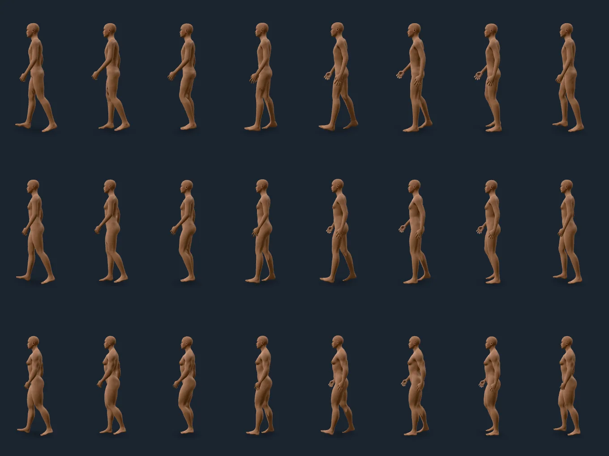

*`walk_normal` (punkduck's, CC0), age 25, slim, average and heavy from the top.*
The same eight frames of one cycle on three bodies: the legs reach as far as
each body's own legs, the arms swing opposite the legs, the heel lands and the
ball rolls off. Nothing is retargeted by hand per body: the clip is rotations on
the shared skeleton, and the body's own proportions do the rest.

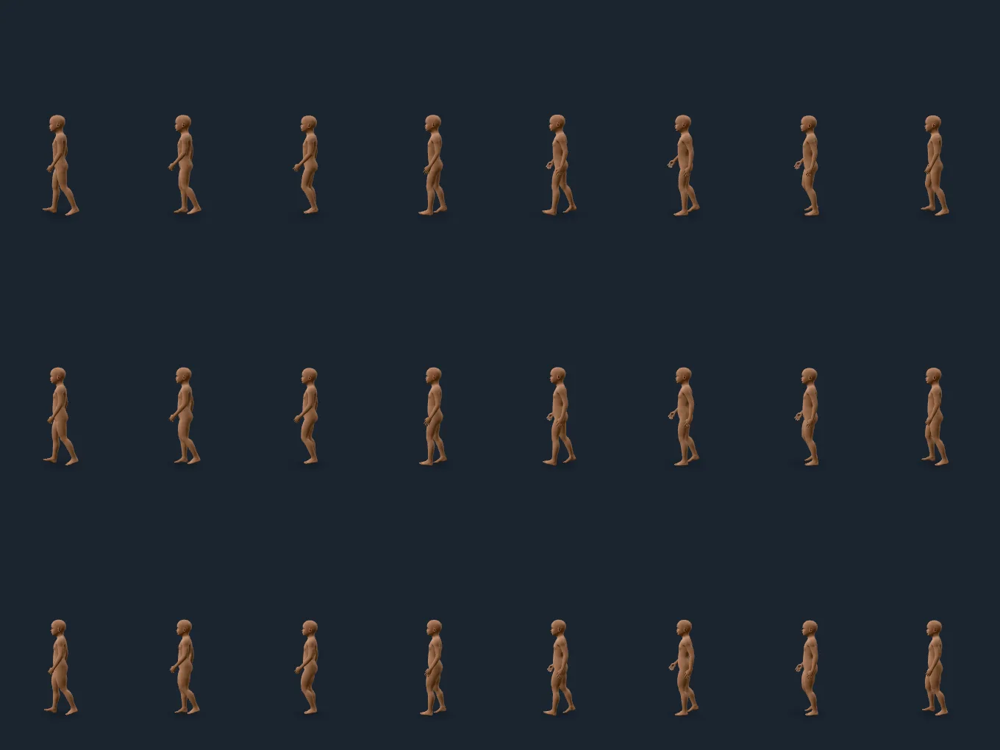

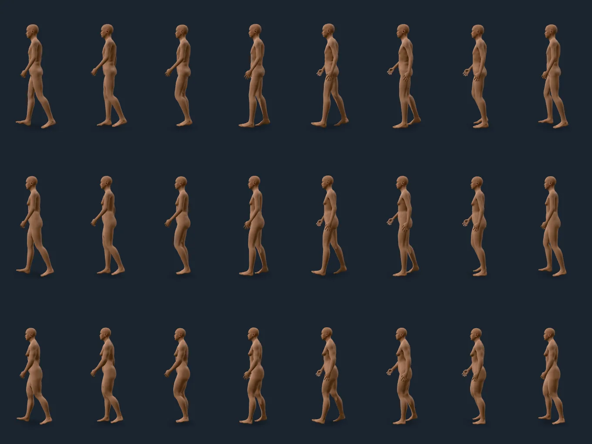

*The same clip at 6 and at 75.* A child's stride is the child's: about 0.33 m a
cycle against an adult's 0.65, by construction (root motion is derived from the
figure's own feet, so the shorter legs carry it less far). No foot skates:
`stanceDrift` follows every planted heel and ball over four cycles on nine
figures, and the largest it moves is 2 to 6 mm in this walk, 3 to 7 mm in the
hip-swaying `walk_female`, under 3 mm in Quaternius's three walks, and under 10
mm in the idles (against well over 20 mm for the walk with root motion alone,
which a test holds too).

## Idle and swim

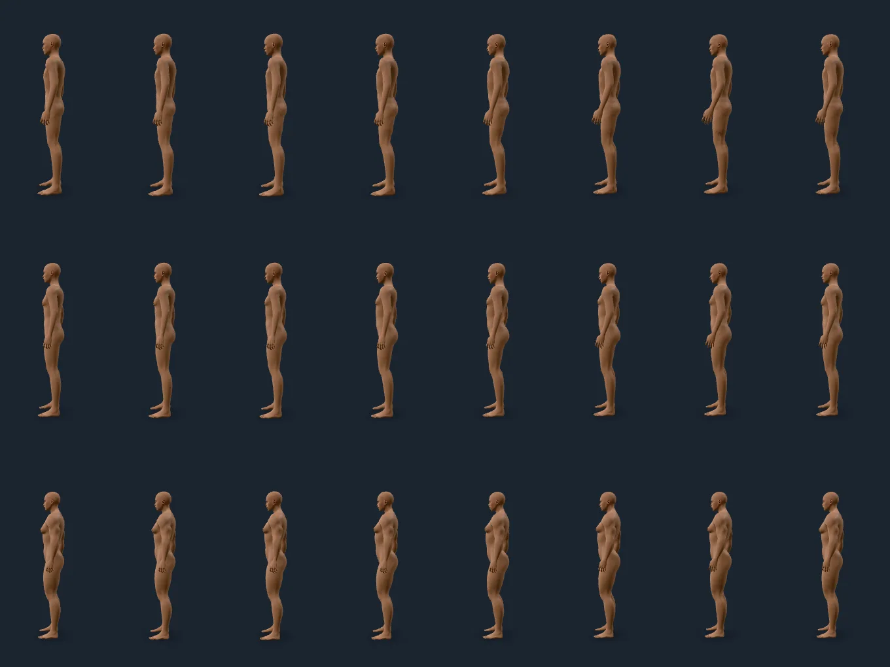

*`idle1`, age 25.* The torso and arms settle a little frame to frame; the feet
stay exactly where they are (an idle carries nobody, and the foot lock holds the
soles to under 10 mm).

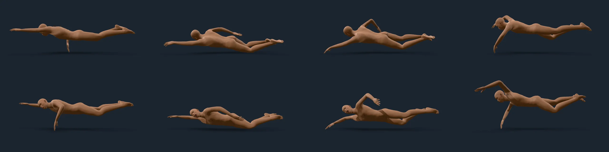

*`swimcrawlstroke`, age 25, side-on at 2.4 m, eight frames of the stroke.* A clip that does not stand on the ground is not
held to it: the figure lifts from its lowest vertex, not its soles, and the
foot lock is off. Arm and leg strokes keep to the body at every size.

## Quaternius's libraries, retargeted

84 animations of Universal Animation Libraries 1 and 2 (CC0 by the `License.txt`
in each archive; only the copies vendored with their checksum), on a rig with
bones of its own axes. They go through a T-pose on both rigs: a source bone's turn
from its T-pose, in the world, is applied to the target bone from its own, the
spine by height. A test puts the library's T-pose through the retarget and gets
the target's T-pose back, bone for bone.

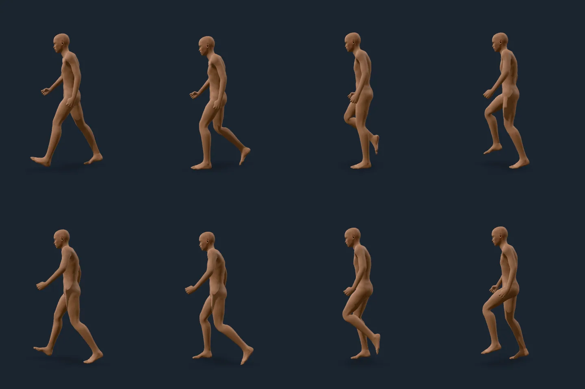

*`walk_loop`, average body.* Knees bend forward, the arms counter-swing, the
feet land heel first. Planted feet move under 3 mm on nine figures.

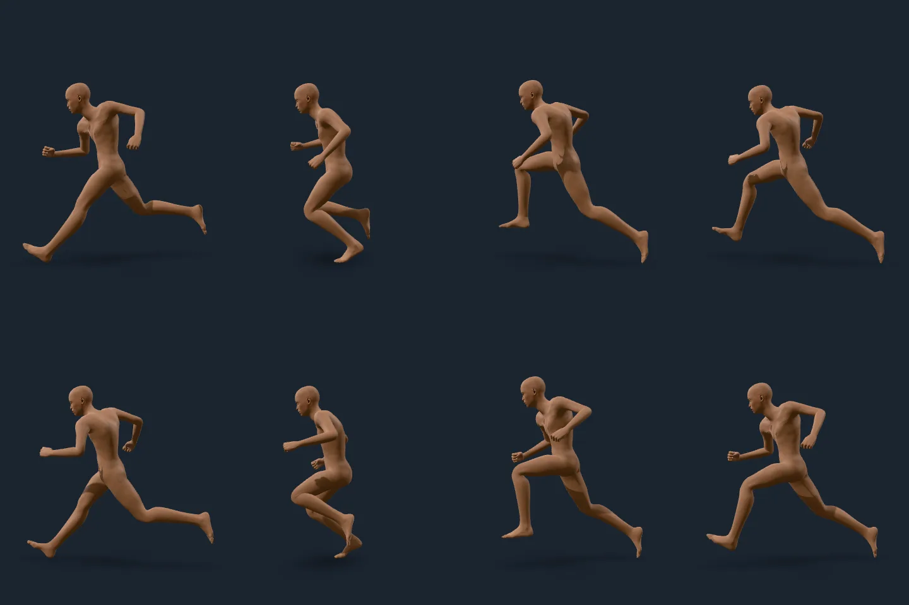

*`jog_fwd_loop`.* The arms are bent and driven, the lead knee comes up and the
trailing leg pushes off. A jog is airborne between strides, so it carries no foot
lock (`grounded: false`); the figure's lift follows its lowest vertex.

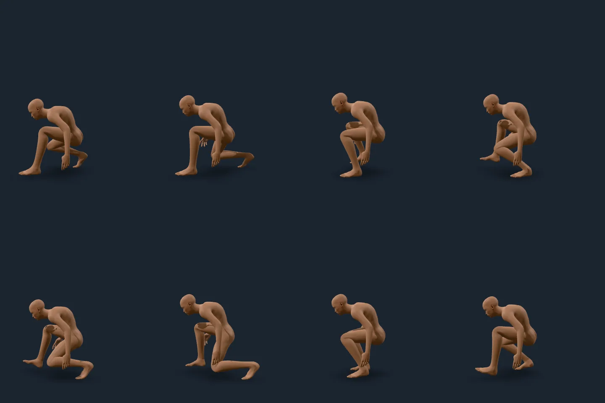

*`crouch_fwd_loop`.* A deep crouch with a hand to the ground. The darker patches
at the knees and hips, here and in the jog, at full flexion read as the creases
layer's shading (`docs/evidence/creases.md`), not the clip; they are the
correctives lane's to judge.

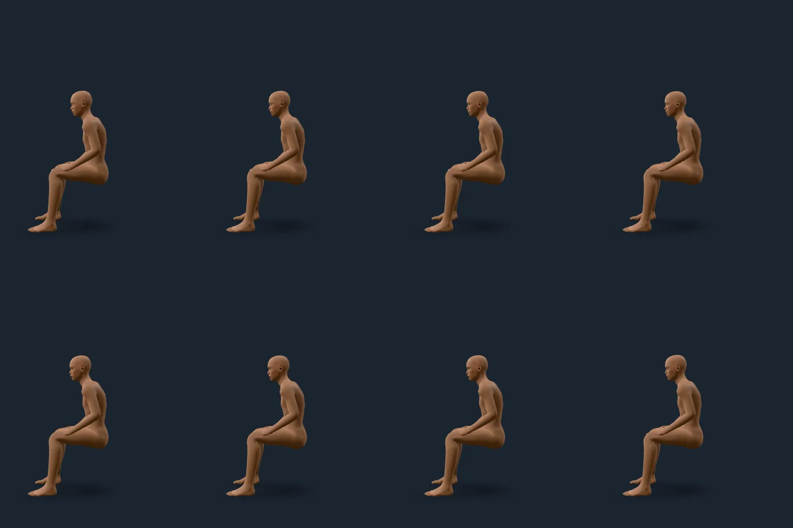

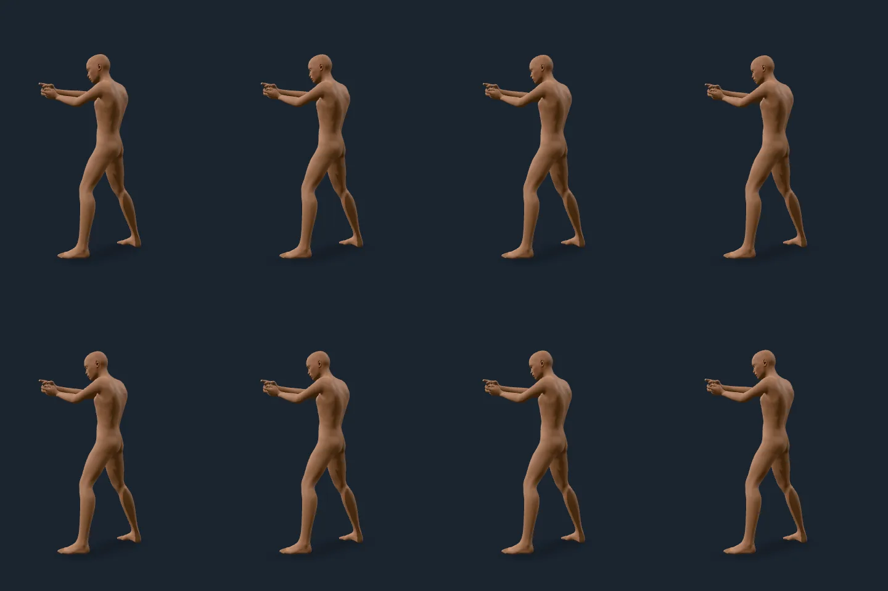

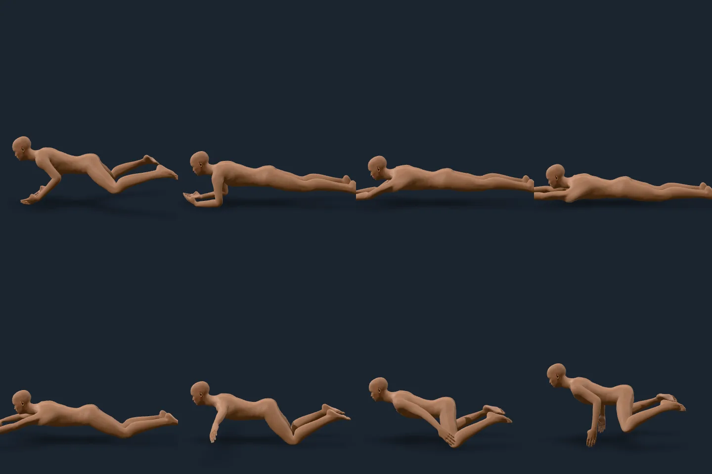

*`sitting_idle_loop`, `pistol_idle_loop`, `swim_fwd_loop`.* The seated clip
sits on nothing (the chair is the game's); the pistol stance holds both hands
together at the figure's own arm length; the swim is the library's crawl.

## No part through another

The body is 14 capsules (head, torso, and each side's upper arm, forearm, hand,
thigh, shin and foot), their radii measured from the figure's own skin. In every
frame of every clip, on nine figures (slim, average and heavy at 6, 25 and 75),
no two parts that are not neighbours overlap by more than 25 mm of capsule (a
capsule is a coarse stand-in for a limb): 72 of the 90 clips hold that outright.

The other 18 are clips where a limb *rests on or crosses* the body: a hand on the
knee, folded arms, a kneel, a roll, a sword swung across the chest. Each has its
own bound in the test (`CONTACT_CLIPS`), from 47 mm (`death01`) to 127 mm
(`slide_exit`, a body sliding with a leg folded under it), and the test fails on
any frame past it. They are bounds to hold the clips to, not collisions to fix: a
hand on a thigh is meant to touch it. The walks, idles, jogs, sprints and
swims have none.

The same check holds with the legs turned by the foot lock: no leg passes through
the other in a walk, on nine figures.

## What is not claimed

- **`crouch_fwd_loop` skates up to 36 mm** (the test holds it under 50). The
  measured drift is the ball of a planted foot sweeping across the floor while
  its heel does not move (0 mm): the clip swivels the foot on its heel for a
  second or so while it stays flat, and the lock pins one point per foot and
  keeps the clip's own foot orientation, so a twist of a planted foot is the
  clip's and is not held. The bound is the clip's own. A zombie's shuffle
  measures 18 mm.
- A hand-keyed clip is the limit of the foot lock, not the lock: a clip that
  planted its feet would leave nothing to hold.
- Jogs and sprints, swims, sitting and anything else that leaves the ground are
  `grounded: false`, and are held by nothing.
- Adult animations are out of scope.
