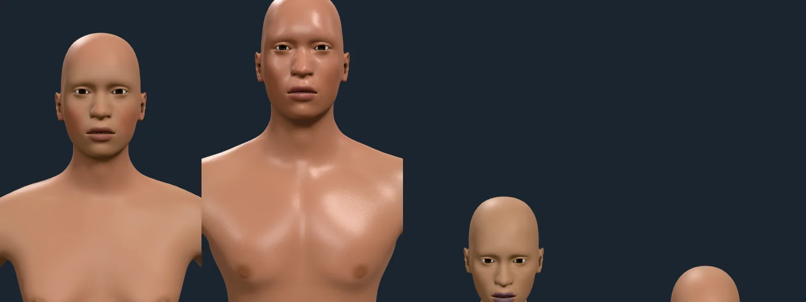

# Field atlas packing

The skin layers' field atlas packs any layers whose supports lie apart into
shared channels (`planAtlas`, `docs/ARCHITECTURE.md`, "Atlas packing"). The
change must show nothing: the same skin, to the pixel.

Rendered 2026-10-09 by the integrator's shared sheet pass, at 2× pixel density,
the same four bodies and signals on both sides (blush; exertion and heat; cold
and fear; a child with blush) at the face and chest:

Before the packing (commit 0ead2a9: two layers a page, 10 pages, 40 MB for the
20 layers).

After (commit 881c99f: 27 channels, 7 pages, 28 MB).

The two renders were compared channel by channel: 0 of 3.84 million values
differ. The flush on the cheeks, the lips, the areolae, the blush, the
goosebumps and the pallors are exact. The elbow and knee creases, the flush
layer and the areola are one group sharing a value channel and a coordinate
channel, told apart by an owner map.
