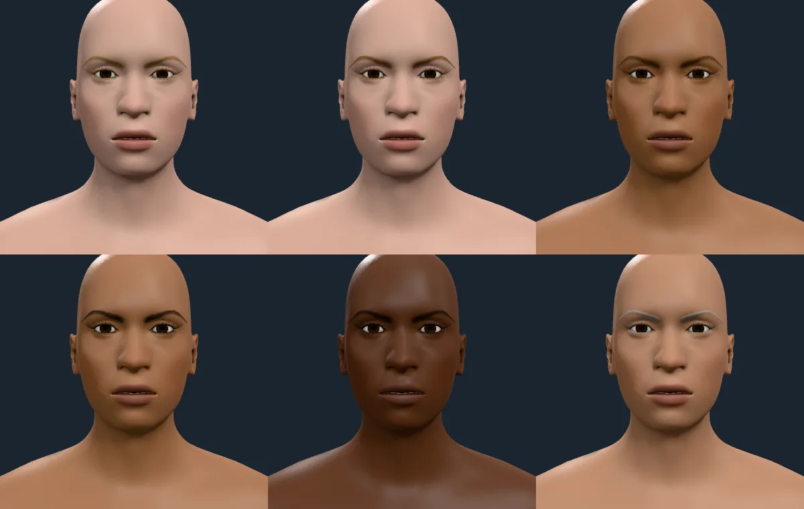
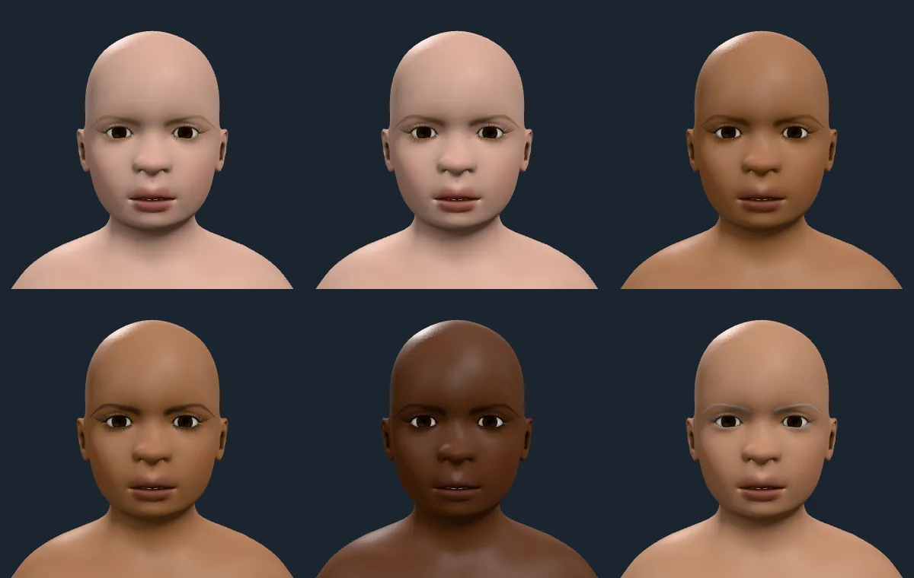
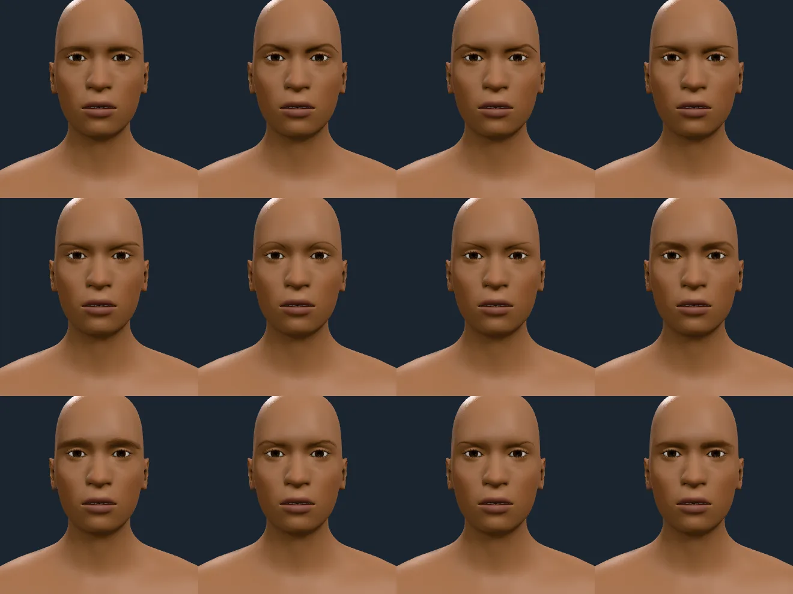
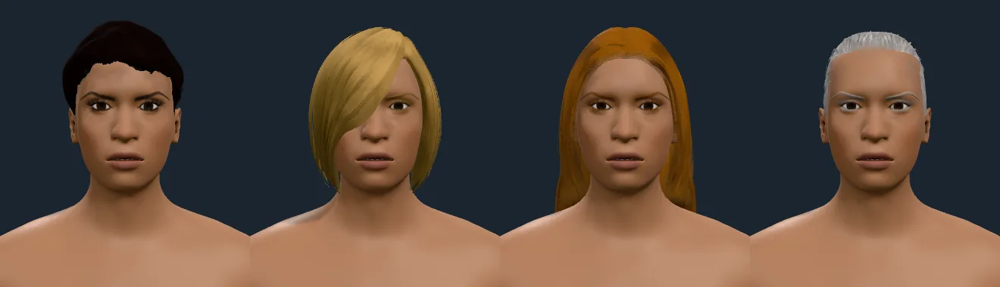

# Eyebrows and eyelashes

The twelve brows and four lashes of MakeHuman's system assets, as decals in the
hair pack (`docs/ARCHITECTURE.md`, "Eyebrows and eyelashes (the hair pack)").
Every sheet below is the integrator's render of `integration` through
`hk-sheets`, on 2026-10-09, at the revision named in the caption; the numbers
cite the tests that hold them.

## The finished brows

*Age 45, `eyebrow002`, `eyelashes02`, no scalp hair. Top row: golden blonde and
ginger on pale skin, brown on tan. Bottom row: black on tan, black on the
deepest skin, and white (60 % grey) on a mid-light one.* Each brow is its own
hair colour and no other: the golden blonde is gold, not olive; the white is a
clean pale grey, not blue; the black reads as black on the deepest skin and is
still visible there. Nothing frames a brow, and a brow fits the forehead's slope
and the brow ridge's width at every tone.

*Age 6, the same six colours and skin tones.* A child's brows and lashes are
finer and fewer: the decal's opacity ramps from 0.45 (brows) and 0.7 (lashes) at
birth to 1 by age 14, so the same brow reads as a faint line at 6 and a full one
at 45. The ramp is a **choice**: no source of brow or lash density by age ships
in this repository, so it is tuned against these sheets.

*The twelve brow styles, `eyebrow001` to `eyebrow012`, on one face at 45.* They
differ in thickness, arch and how far they run toward the temple; each sits on
the brow ridge and none crosses the lid or runs off the forehead.

*Scalp hair and brows together, four colours: black, golden blonde, ginger and
white.* The brow takes the scalp hair's colour; a test holds a brow and a scalp
card of one colour under one light to the same colour shares within 0.02 (and a
brightness within a third).

## What went wrong on the way, and the causes

| Sheet | What it showed | Cause | Fix |
| --- | --- | --- | --- |
| first | brows were a few hard pencil strokes | the alpha test and alpha-to-coverage kept a stroke or dropped it: a brow is a band of hairs thinner than a pixel | blend by the mask's alpha, with a soft fill (two blurs of the mask, a mip each) under the strokes |
| first | a faint halo round each brow | the decal, 2 mm off the skin, cast a shadow onto the skin round its quad's outline | the decal casts and receives no shadows |
| v1 | blonde brows were olive, white brows grey-blue | **not** a tone-curve crush, as first guessed (and a colour lift added, which only hid it): the skin's shadow fell on the decal and shaded it | no shadows; the lift removed; the material takes `HairMaterial`'s base specular and sheen so the brow and the scalp agree |
| v1 | a brow vanished into the brow ridge on some figures | the body is drawn subdivided and the decal is bound to the coarse mesh, whose smooth surface swallows it by up to 1.8 mm | a 2 mm lift along the normal (`DECAL_LIFT`), with a test that fails without it |

## What the tests hold

- Four brows (`eyebrow001`, `006`, `009`, `012`) stay on the subdivided skin, not
  under it, at ages 6, 14, 45 and 75: the lowest vertex is above the surface, and
  nine in ten are within 4 mm of it (`tests/browsModel.test.ts`, "a brow's fit on
  the skin"; it fails without the lift).
- A brow and a scalp card of one colour share their r and g shares within 0.02 and
  their brightness within a third (`tests/browser/decalHue.test.ts`).
- A decal draws without writing depth, over the skin by a polygon offset
  (`tests/browser/decal.test.ts`); it draws as a `DecalMesh` with no shadows
  (`src/react/Humanoid.tsx`).
- A recipe without `hair.brows` serialises as it did before they existed, and an
  id of the wrong kind is refused by name (`tests/browsModel.test.ts`); the picker
  lists every brow and lash of the pack (`tests/browsEditor.test.ts`).
