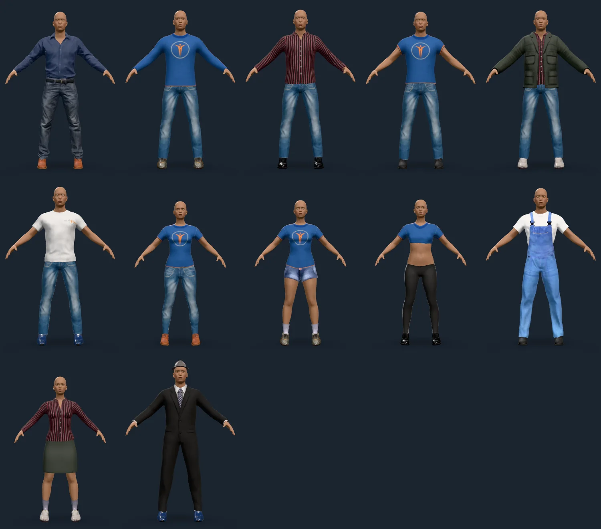
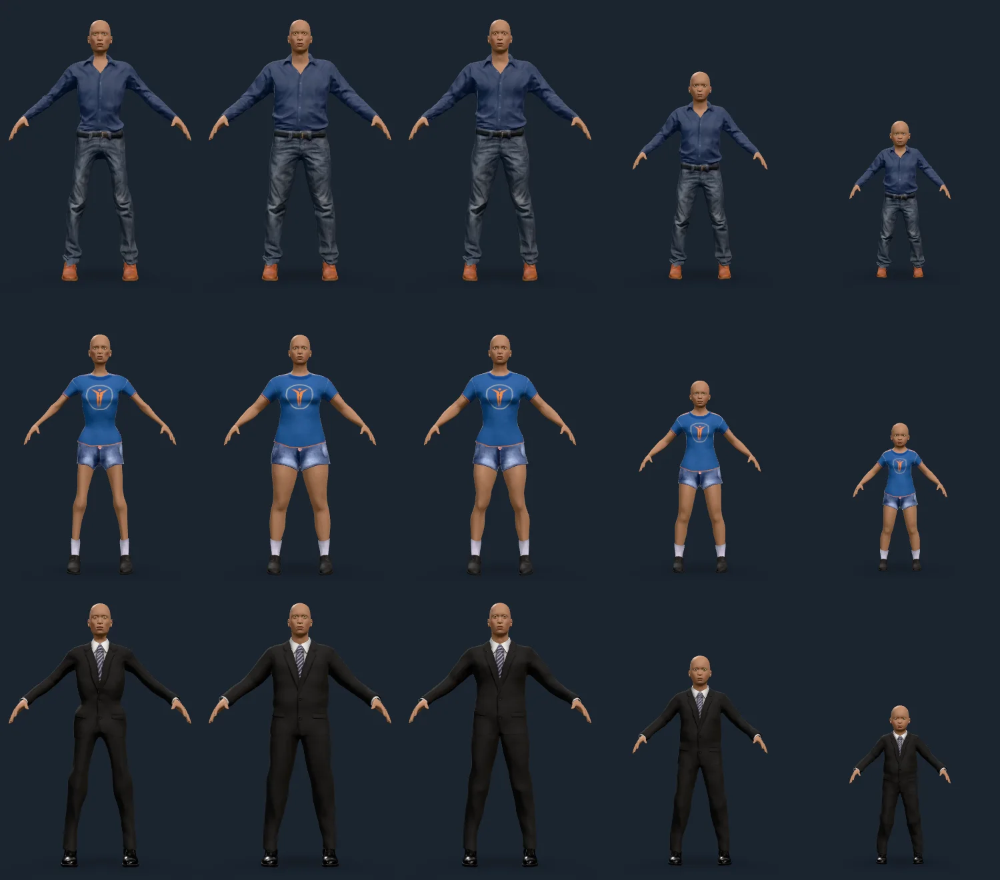
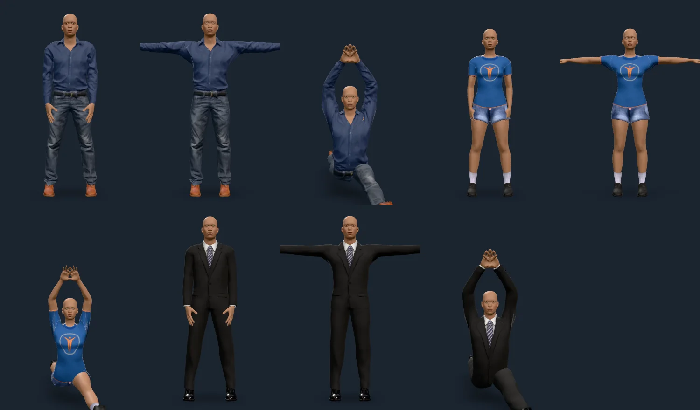
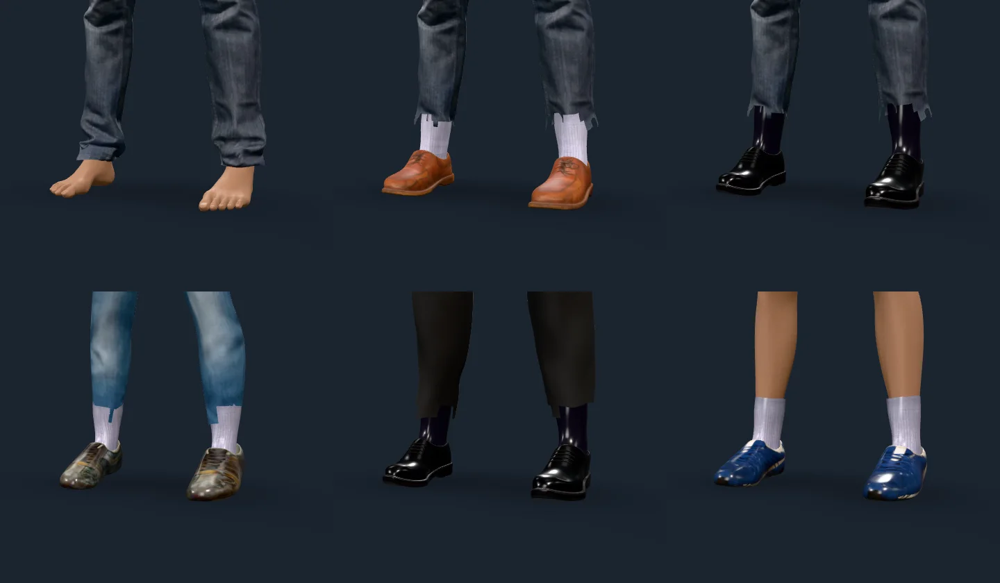
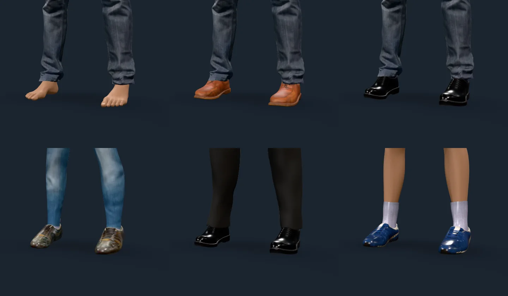
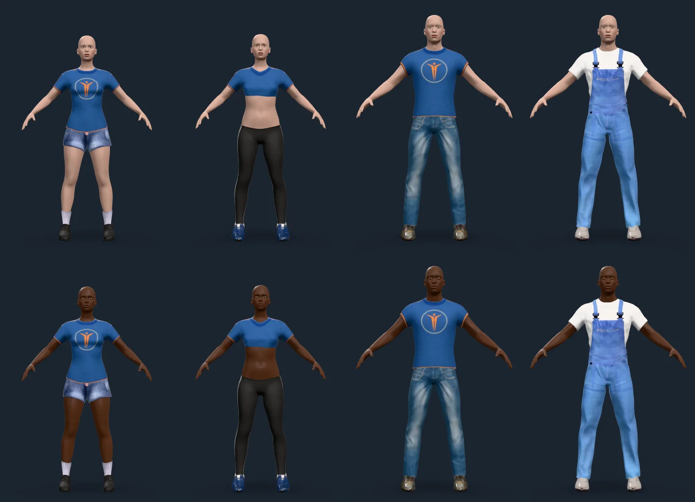
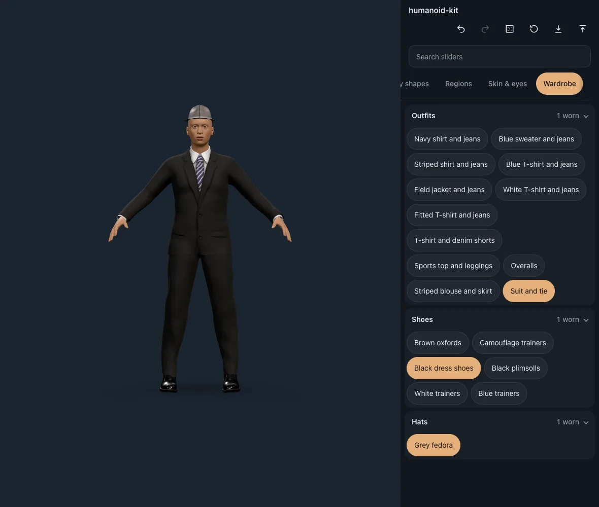

# Clothing

Rendered on 2026-10-09 with `scripts/contact-sheet.mjs` against the playground
(`?clothing`), on the studio stage: the garments of `humanoid-kit-clothing`
worn by figures of the base mesh. Every sheet was read figure by figure for skin
showing through, gaps at cuffs, necklines and hems, and cloth sinking into the
body; what it found is listed under each.

## Every garment

Left to right, top to bottom: `male_casualsuit01` to `06`,
`female_casualsuit01` and `02`, `female_sportsuit01`, `male_worksuit01`,
`female_elegantsuit01`, and `male_elegantsuit01` with `fedora01`. The shoes
cycle through `shoes01` to `06`, so every pair is shown too.

Each suit is a complete outfit (shirt, trousers, and for the elegant ones a
jacket in one mesh). The sports top ends above the waist by design, and the pink
spot on the denim shorts is a button in the texture.

## Shape and size

Left to right: lean, heavy, muscular, age 12, age 7; the rows are
`male_casualsuit01` with `shoes01`, `female_casualsuit02` with `shoes04`, and
`male_elegantsuit01` with `shoes03`. A garment binds to the base mesh by vertex
and scales its offsets by the body's own measurements, so it follows every
build, and a child's fit is the same garment on a child's body, not a resized
copy. No skin shows through at the neck, wrists or waist at any of the five.

## Poses

Left to right: relaxed, T-pose, benchmark (every joint bent to its extreme, with
the figure kneeling and the arms raised). Garments are skinned to the figure's
own skeleton with the body's weights, so cloth follows the pose and a kneeling
figure rests on whichever of knee and shoe is lower. The pack has no walk pose
yet (animation packs are milestone 8), so the three poses it does have are
shown; the benchmark is the harder test, since it bends the elbows, shoulders,
hips and knees past what a walk reaches.

## Layering at the feet: the fault, and the fix

Before: garments ordered by MakeHuman's category table, which puts shoes (57)
over trousers (47).

The system shoes declare `z_depth` 5 against the suits' 50. Ordered by category
the shoes were the outer layer, so their `delete_verts` hid the part of the
trouser leg that lies over the ankle, and the cut followed the mask's face
boundary: a torn, staircase hem with the sock showing above the shoe.

After: ordered by the asset's own `z_depth` first, then the category.

The same six figures (the first without shoes). The hem hangs over the shoe as it
does on a person, and as MakeHuman draws it, which orders by `z_depth` too.
`docs/ARCHITECTURE.md` ("Clothing") has the reasoning; a test pins the order.

## Light and dark skin beside sleeveless and short garments

Top row melanin 0.04, bottom row 0.95. Left to right: the T-shirt and denim
shorts, the sports crop top and leggings, a T-shirt and jeans, and overalls over
a T-shirt. The edge of a sleeve or a hem is where hidden skin meets drawn skin,
so it is where a mismatch would show: the skin continues across every sleeve
edge, hem and waistline at both ends of the range, with no seam, halo or
lighter band, because the skin under a garment is not rebuilt or re-coloured,
only left out of the draw.

## The wardrobe

The creator offers a Wardrobe tab when the client loaded a clothing pack: the
garments by kind, one worn per kind, layered across kinds, each change one undo
step. Picking a garment changes the outfit without rebuilding the body, so a
slider drag over a dressed figure stays as smooth as over a bare one.
