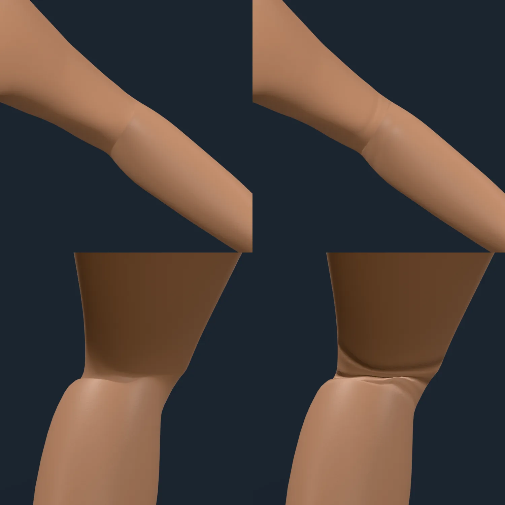
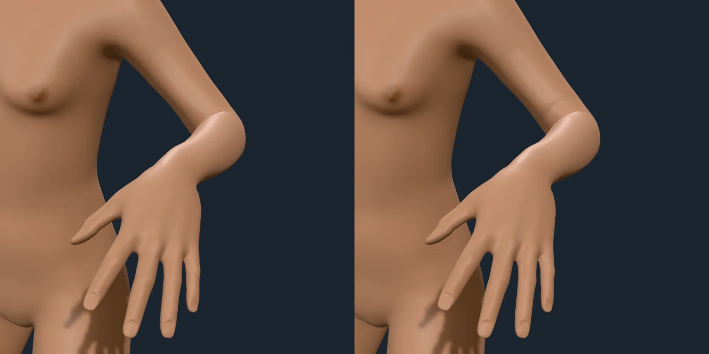
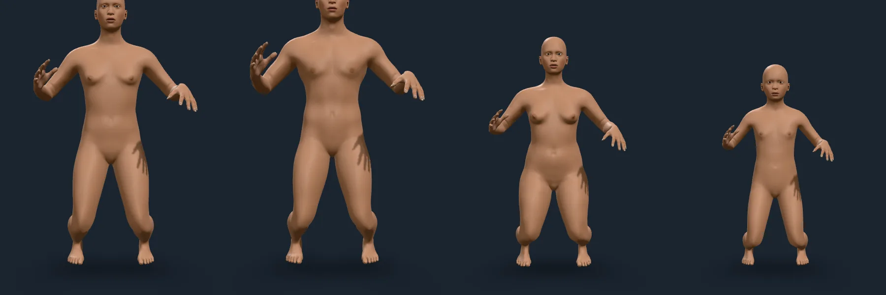

# Joint creases

Rendered on 2026-10-09 with `scripts/contact-sheet.mjs` against the playground,
on the studio stage, at 2× pixel density, with the camera 0.3 to 0.5 m from the
skin: the same figure and pose, once with the crease depth set to zero (left)
and once as shipped (right). The poses are `bent` (elbows about 90°, knees about
80°) and `tpose` (arms straight), authored for the check
(`scripts/poses/bent.json`). The creases follow the pose's flexion signals
(`flex.elbow.L` and so on); magnitudes and what is measured against what is
art-directed are in `docs/ARCHITECTURE.md`, "Joint creases".

## The crook of a bent joint

Top: the elbow's crook, seen from inside the bend. Without creases the skin is
smooth up to the step where the weights hand over from the upper arm to the
forearm; with them, two folds cross the crook. Bottom: the back of the knee,
whose skin folds in several grooves as the shin comes up (the strain there is
over 60 %, so the folds are the deepest of any joint). The grooves are narrow
cuts in flat skin, not ripples: that is what the light catches.

The same bend from the front. The fold across the elbow reads as a skin fold
and not a seam; the forearm and hand beyond it are unchanged.

## The outside of a bend has none

A first version also wrinkled the outside of the bend (the kneecap's and the
elbow's point's skin) while the joint was straight. It drew four deep rings
round the straight knee, which read as a stack of bands, then a faint trace
over the kneecap, and a pale ring round the wrist. The measured strain there is
a stretch, which draws skin smooth, and nothing measured says how loose skin
wrinkles, so those layers were dropped, not tuned (ARCHITECTURE.md).

## Body types

The `bent` pose on the average adult, a muscular man, a short full woman and a
ten-year-old. Creases are close-up relief: at full-figure distance (above) they
are finer than a pixel and fade out, so these figures show the posed geometry
only. The dark streaks beside the hips are the fingers' shadows, not skin.

## What this does not show

The wrists' creases are 2 across 6 cm of skin at a quarter of the knee's strain
and show at no angle tried; they are in the layer stack and tested, but the
wrist is the joint with least to see. Skin colour darkens and reddens at an
extended elbow or knee (SKIN-STATES.md, A2); that is a colour term and not part
of these detail layers.
