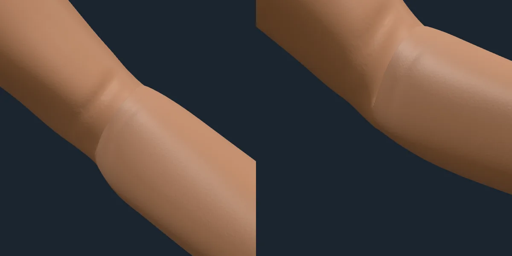
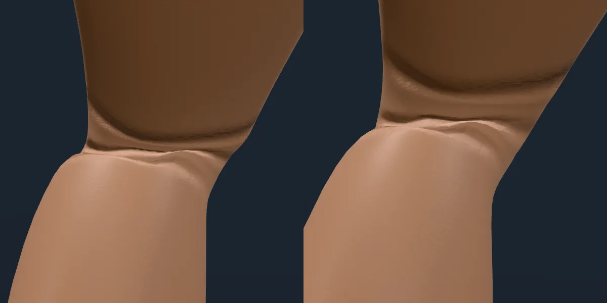
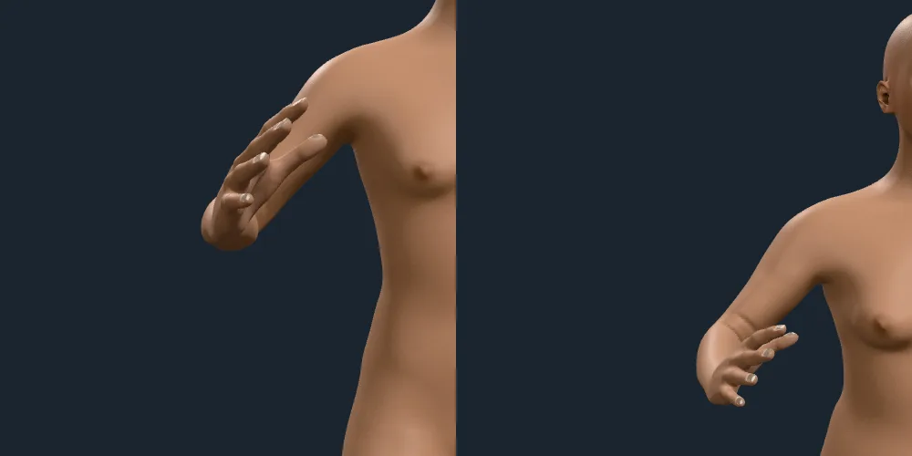
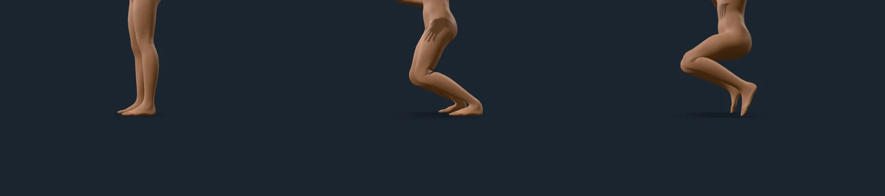

# Joint creases

Rendered on 2026-10-09 by the integrator's shared sheet pass against the
playground, on the studio stage, at 2× pixel density. The poses are `bent`
(elbows about 90°, knees about 80°, the ankles bent back to keep the soles
level) and `tpose`, authored for the check (`scripts/poses/bent.json`). The
creases follow the pose's flexion signals (`flex.elbow.L` and so on); how the
fold's depth follows from the measured strain, and what is art-directed, are in
`docs/ARCHITECTURE.md`, "Joint creases". Only the elbows and the knees have
creases.

## The crook of a bent elbow

The inside of the bend, seen from inside it: the fold takes up the skin that the
bend compresses (2.8 mm deep, from the 25 % measured strain). It is on the inside
of the bend only, within about 63° either side of the way the joint folds.

## The back of a bent knee

Several grooves as the shin comes up (6.2 mm deep, from over 60 % strain): the
deepest of any joint. The grooves are narrow cuts in flat skin, not ripples:
that is what the light catches.

## Seen down a limb

A bent forearm points at the camera in a front view, so the elbow's crease,
17 cm up the arm, is projected onto the forearm just above the hand. A groove is
a thin line, so it fades by its screen footprint (it is gone by the time a
period is three pixels): it shows as one fine line and not as a dotted ring.

## Body types

The `bent` pose on the average adult, a muscular man, a short full woman and a
ten-year-old. Creases are close-up relief: at full-figure distance they are
finer than a pixel and fade out, so these figures show the posed geometry only.
The pale band at the screen-right wrist of the first, third and fourth is
lighting on the bent wrist's back: it is the same with no crease layer and with
linear skinning everywhere (checked on sheets of both). The dark streaks beside
the hips are the fingers' shadows, not skin.

## The feet of a bent figure

A figure's lowest point is on the floor, and in `bent` the soles lie flat on the
contact shadow like the T-pose's: the pose bends each ankle back 60° so the
folded knees and raised hips do not leave the feet pointing down. (The flexed
pose, the deep crouch on the right, is not part of this check.)

## What is not here

Wrists and the outside of each bend (the elbow's point, the kneecap) have no
creases: what was drawn there read as a bracelet and as bands round the limb, and
nothing measured says where or how deep loose skin wrinkles. Skin colour darkens
and reddens at an extended elbow or knee (SKIN-STATES.md, A2); that is a colour
term and not part of these detail layers.
