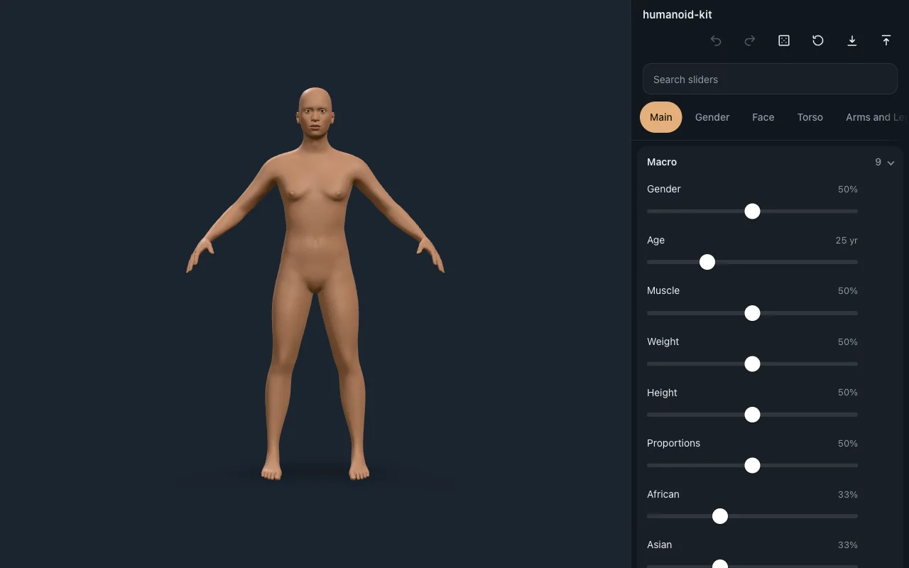
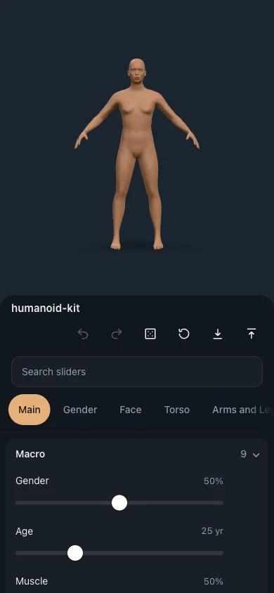
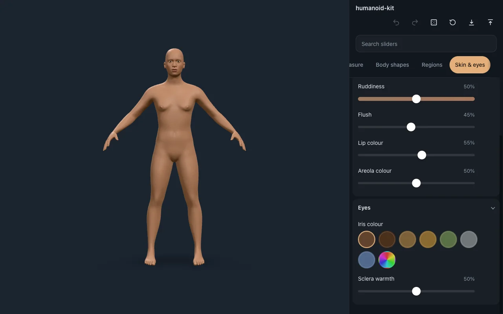

# The creator

`<HumanoidCreator>` in the playground, 2026-10-09, after two fixes made while
gathering this evidence. Before them:

- The six action buttons squeezed the title to "humanoi…". The tab strip cut
  its last tab off with nothing to show more followed, and its tabs were 36 px
  tall, under the panel's 44 px touch size.
- The skin tone, undertone and ruddiness tracks and the iris swatches all drew
  white, from a 0–255 versus 0–1 mix-up in the colour helpers.

## Desktop, 1280 × 800

## Phone, 390 × 844

## Skin and eyes

Each skin track shows the skin its slider gives, for the current figure. The
iris palette shows the natural colours.

No errors reach the console at either size. The creator e2e
(`e2e/creator.spec.ts`) taps the face, a hand, a foot and the stomach, and each
tap opens the controls that shape the tapped part.
