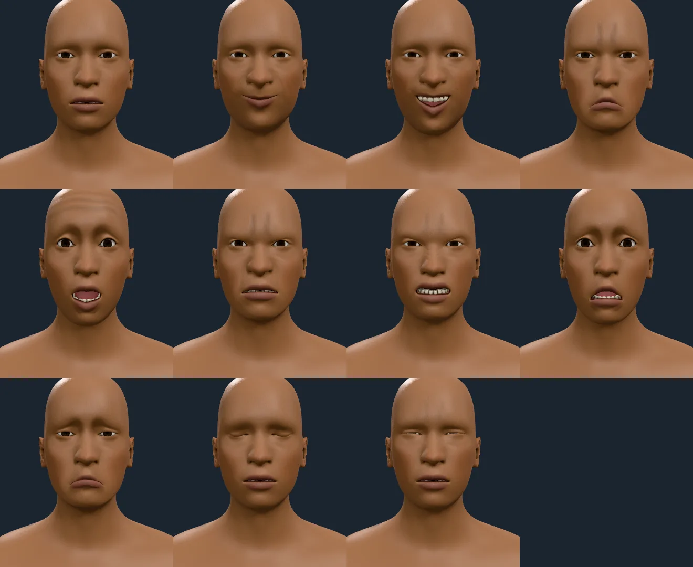
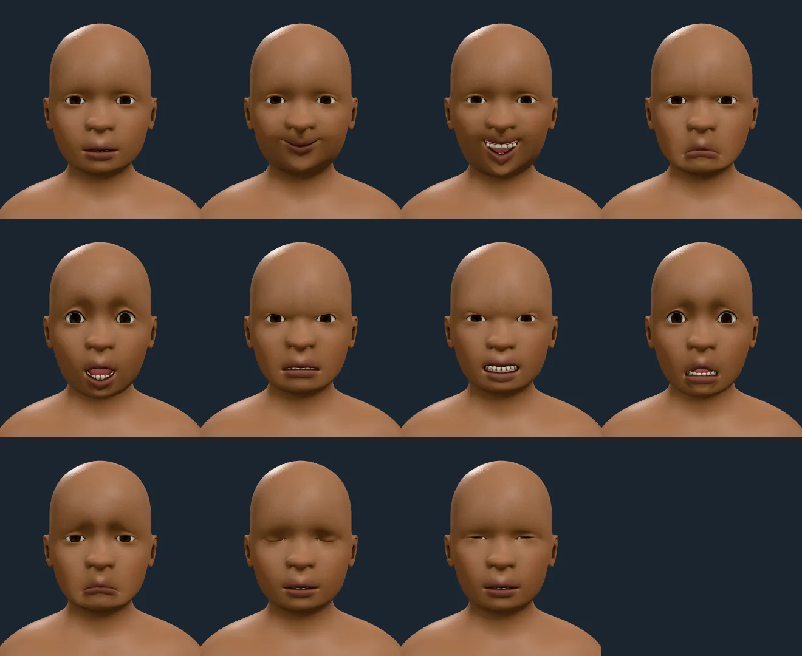
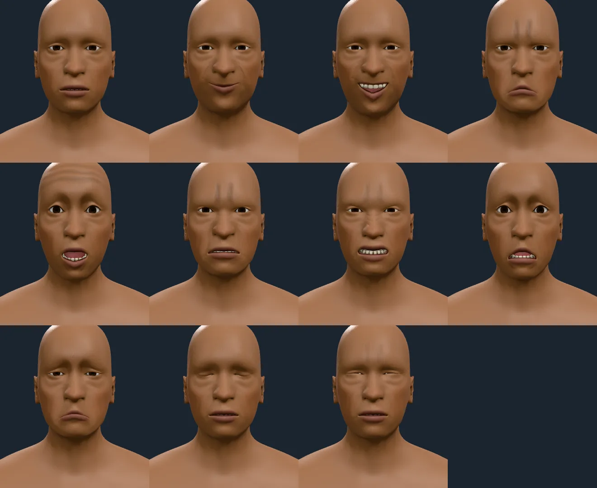
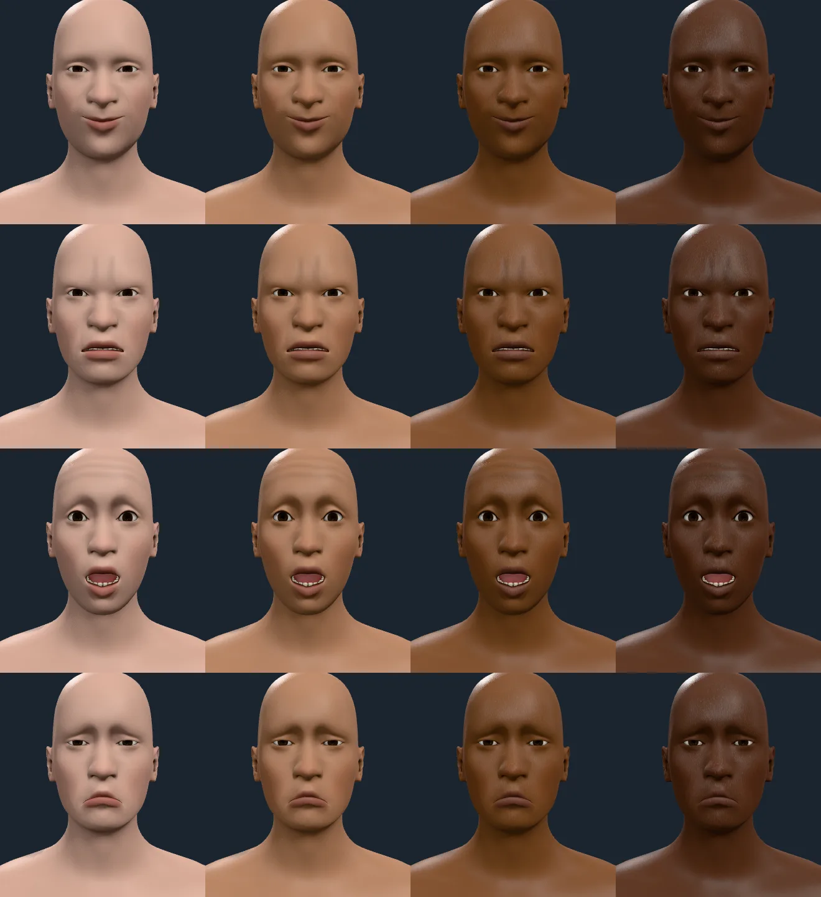
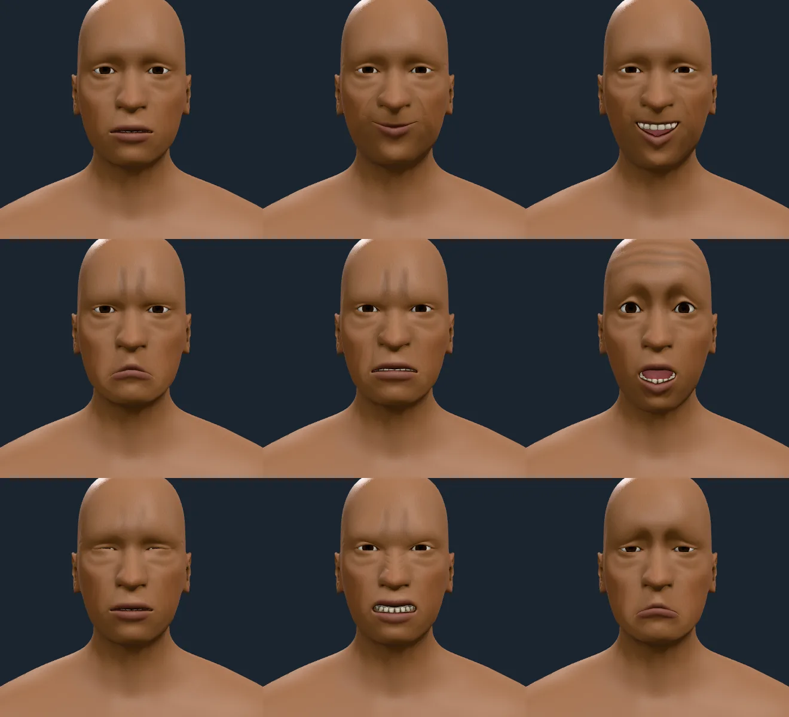
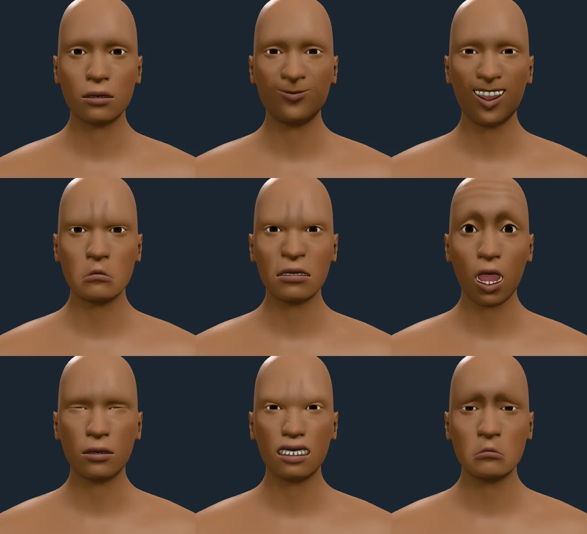
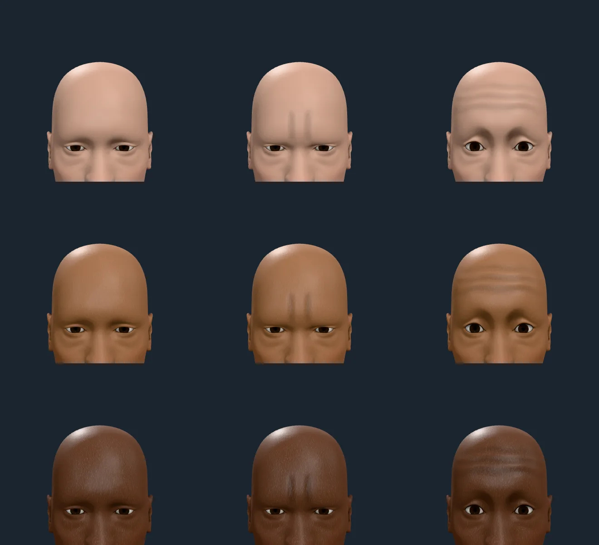
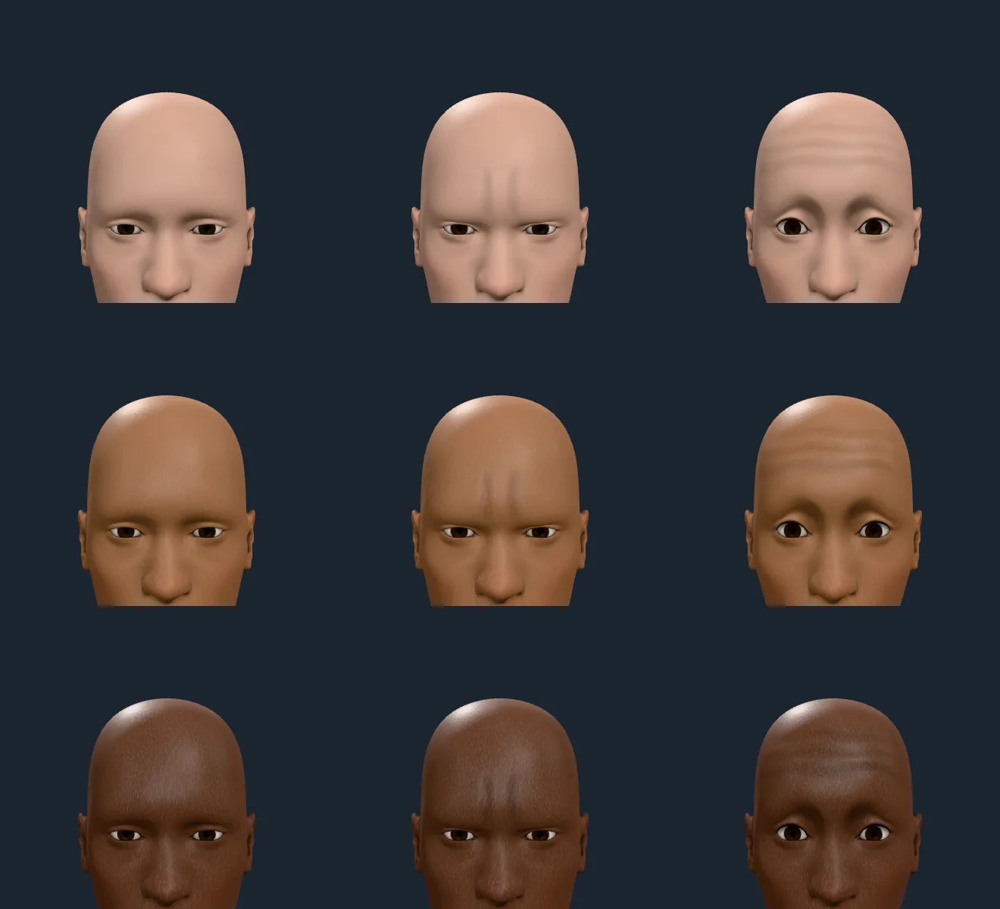

# Expressions

The named expressions (`EXPRESSIONS`, `src/rig/expressions.ts`; ARCHITECTURE.md,
"Named expressions") and the audit of the face rig under them.

## Audit of the face units (2026-10-09)

Every unit and expression was posed on the CPU (`skinPositions`) at ages 6, 14,
45 and 75 and measured against the rest face. No rendering is involved, so each
number is the geometry the renderer skins.

| Check | Result |
| --- | --- |
| A blink (both upper lids closed, lower lids raised) | 0 to 2 % of rays from the eye's centre, in a 35° cone, leave the body at every age, against 36 to 47 % at rest |
| A squint | the opening narrows below three quarters of rest and stays above 2 % |
| Skin moving into the eyeball | none: no unit changes the distance from the eye's centre to the nearest skin by more than 0.6 mm |
| Left units against right units, reflected | identical for the eye, brow and cheek pairs |
| Mouth-corner pairs and central units | **not identical in the authored data**: `NasolabialDeepener` 2.7 mm of 5.6 mm uneven at age 45, `MouthLeftPullUp` against `MouthRightPullUp` 0.45 mm, `UpperLipStretched` 0.45 mm |

The asymmetry is in MakeHuman's frames (`NasolabialDeepener` rotates the right
nose-wing bone 7.8° about Z and the left not at all), and the pack now carries
every unit as the mean of itself and its partner's reflection
(`scripts/lib/faceUnits.ts`), so the expressions below move both sides alike: a
test poses each at age 45 and holds the skin to its own mirror within 0.1 mm.

## The ten expressions

*Age 45, melanin 0.5, `integration`, no scalp hair. Left to right, top to
bottom: neutral, smile, grin, frown, surprise, anger, disgust, fear, sadness,
blink, squint.* Each is `expressionUnits(id, 1)`, a FACS-grounded weighting of
the pack's units (ARCHITECTURE.md, "Named expressions").

What to read in it: the smile lifts both corners with a little cheek and no teeth;
the grin parts the lips on a clean row of teeth with the lower gum and tongue
behind them; surprise opens the jaw and lifts the brows to 0.7 (at full weight the
lift made a boxy ridge over each eye); anger draws the brows down and tightens the
mouth; a blink closes the lids fully (under 2 % of rays from the eye's centre
leave the body) and a squint narrows them without closing. The weights are
**choices** tuned against these sheets, not measurements.

*Ages 6 and 75.* A child's face moves as freely as an adult's, with no lines; an
old face shows them (below).

*Melanin 0.05, 0.35, 0.7 and 0.95 left to right; smile, frown, surprise,
sadness top to bottom, age 45.* The teeth, gums and mouth's lining hold at every
tone, and the lids and mouth corners move the same; the teeth are the lightest
thing in the face at every tone, as a tooth is.

## What was wrong, and what fixed it

| Sheet | What it showed | Cause | Fix |
| --- | --- | --- | --- |
| v1 | the teeth in a grin, snarl and fear read dim grey-olive | the bake's openness is a tenth or less for teeth the lips have parted a little, since it counts every ray the lips, cheeks and chin block within 5 cm; the pose-keyed blend matched the exact bake within 12 % for every expression, so it was the bake's scale, not the blend and not the key set | the teeth material raises the openness to `TEETH_EXPOSURE` = 0.5 (`patchOcclusion`'s `exposure`): a tooth a tenth open gets 0.42 of full light, not 0.24; a covered tooth stays at the floor, an open one is unchanged. The floor is not raised |
| v1 | pink between the lower teeth and the lower lip in a grin: the tongue through the teeth? | not the tongue: the pink is the lower gum, which the teeth mesh carries | a test holds the tongue behind the plane of the lower teeth's fronts in every expression at ages 6, 14, 45 and 75 (`tests/expressions.test.ts`) |
| v1 | surprise had a boxy brow ridge | the brow units at full weight | surprise's brow weights are 0.7 |
| v2 | wrinkle masks reached up over the crown | masks built from heights leak across the coarse forehead's big triangles | the forehead's and the furrows' masks are bounded by distance along the skin from the brows' band (`distanceFromBrows`), and a test holds every layer's mask to its anatomical extent |

## The teeth, the tongue and the lining

The gums were a saturated red (`docs/evidence/gums.md`), and the mouth's lining
and tongue are painted by the skin stack (`docs/evidence/mouth-lining.md`); the
sheets above are rendered with both. The teeth's light does not depend on the
skin's tone, so the same teeth read the same across the tone sheet, and the gums
take the figure's melanin.

## The expression lines

*Age 75, melanin 0.5, `integration` at 43e7ba0. Left to right, top to bottom:
neutral, smile, grin, frown, anger, surprise, squint, disgust, sad.* Nothing on
the neutral face. The frown and anger draw two short vertical furrows between the
brows; surprise draws three uneven lines across the raised forehead, sagging and
breaking up toward the temples; the smile, grin and squint fan crow's feet from the
eyes' outer corners and deepen the nasolabial folds; disgust wrinkles the bridge of
the nose.

*Age 45.* The same lines, lighter than at 75 (`expressionAgeFactor`: 1 at 40, 1.4 at
70); at age 6 there are none worth the name (0.2 of the depth), as the age-6 sheet
above shows.

*Four tones, age 75.* The furrows and the forehead's lines read at every tone,
including the deepest: a line darkens the skin by the same step of CIELAB lightness
on every tone, and is cut as a groove the light catches on one side
(ARCHITECTURE.md, "Facial wrinkles").

*The forehead about 12 cm across, ages 75 and 45; rows are melanin 0.1, 0.5 and
0.9, columns neutral, frown, surprise.* The furrows are two grooves 1.5 to 2.5 cm
long with soft ends, between the inner brows; the forehead's lines are three, at
about 2.1, 3.7 and 5.4 cm above the brows' joints, deepest at the centre, uneven,
and broken toward the temples.

### What was wrong with the forehead's lines and the furrow, and why

| Sheet | What it showed | Cause | Fix |
| --- | --- | --- | --- |
| v1 to v2 | lines over the crown | masks built from heights leak across the coarse forehead's triangles | masks bounded by distance along the skin from the brows' band |
| v3 to v5 | the furrow a curled "ʍ" squiggle, forehead lines faint | thin relief on a coordinate interpolated between vertices about 2 cm apart bends | thin lines as colour on colour stops of a coordinate that is a smooth function of position (the palm creases' technique), a smooth line across any triangle |
| v6 | a stamped glyph between the brows and arcs at the temples in surprise, none across the forehead | **not the technique**: the distance array was single precision, so a vertex's stored distance could round below the one it was queued with and the Dijkstra skipped it; most of the forehead's midline was never reached (mask 0) | double precision; tests hold the distance a metric and the midline reached (both fail without the fix) |
| v7 | real lines, but the furrows ran to the hairline, the forehead's lines were even stripes up to the crown, and on the deepest tones the lines nearly vanished | a furrow's mask had no end cap; three lines at one spacing; a multiply by a fraction of albedo is too small a step of lightness on dark skin | furrows capped at 1.5 to 2.5 cm; the forehead's lines lower (top 5.4 cm), sagging, waving, unevenly spaced and broken toward the temples; the multiply chosen per tone for the same L\* step, and a per-pixel groove (the normal tilted by the gradient of the line's own coordinate) |

## Where the lines lie

A test (`tests/faceLines.test.ts`) holds every expression line layer's mask to
its anatomy, measured from the default figure's own joints: the forehead's
reach no higher than the band 6.2 cm above the brows' joints and no wider than
the temples; the furrows' stay between the inner brows, from 1.2 cm below to 2.6 cm
above the joints; the crow's feet lie within 3.6 cm of the outer corner of the eye
and lateral of it; the nasolabial folds run from the nose's wing past the corner of
the mouth; none touches a lip bone (within 9 mm) or the eyeball (within 12 mm); and
the right's are the left's reflected. A browser test holds the shader's grooves to the
reference profile's slope, and a unit test holds the deepest tone's lightness step to
over 0.6 of the fairest's.
