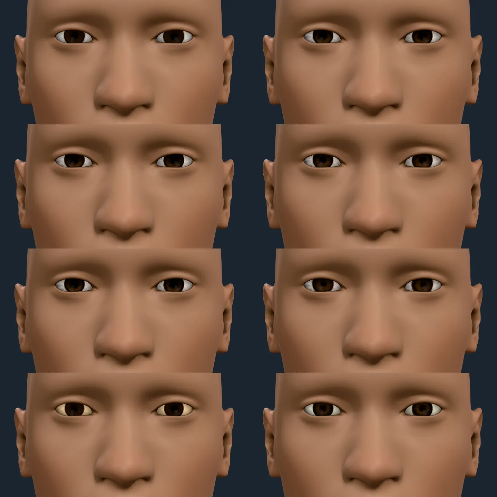
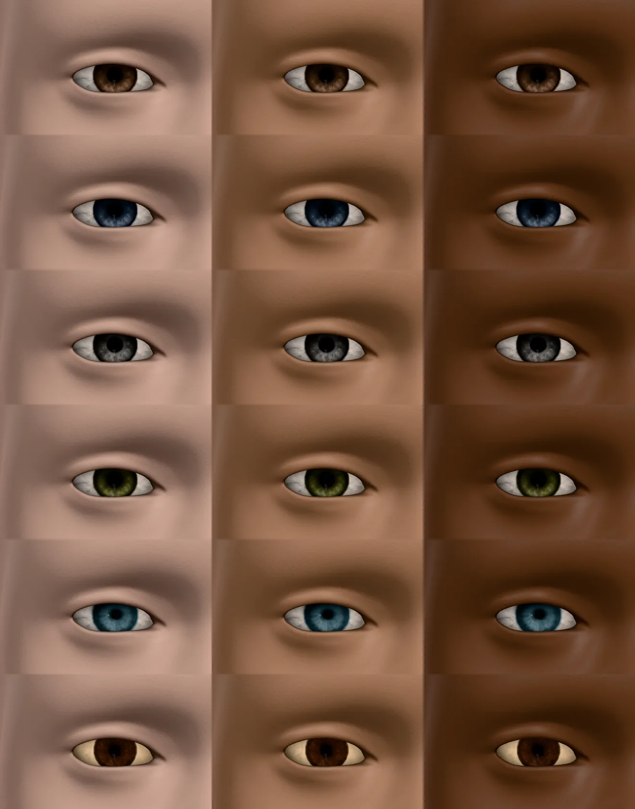
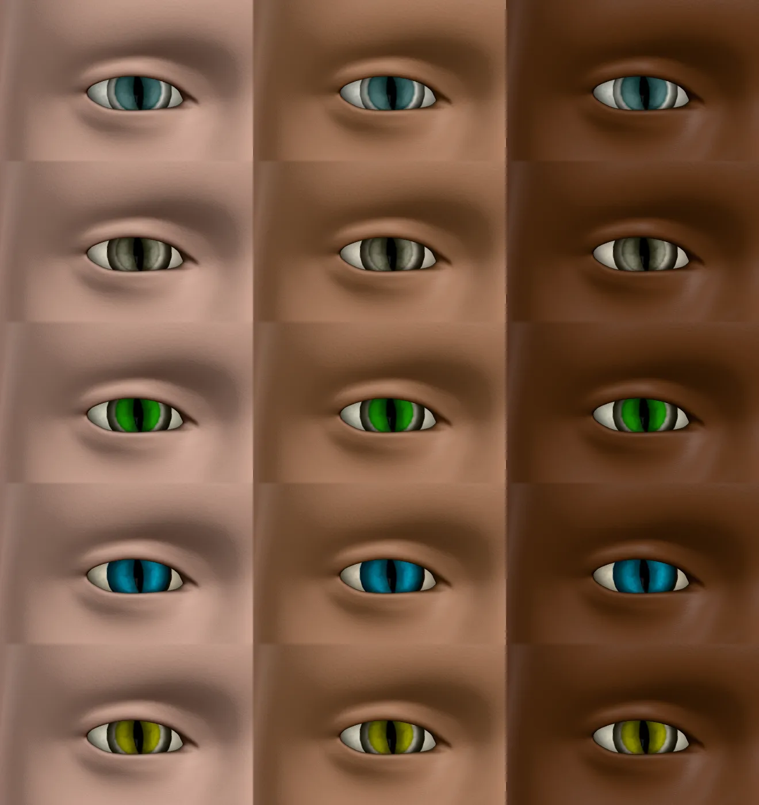
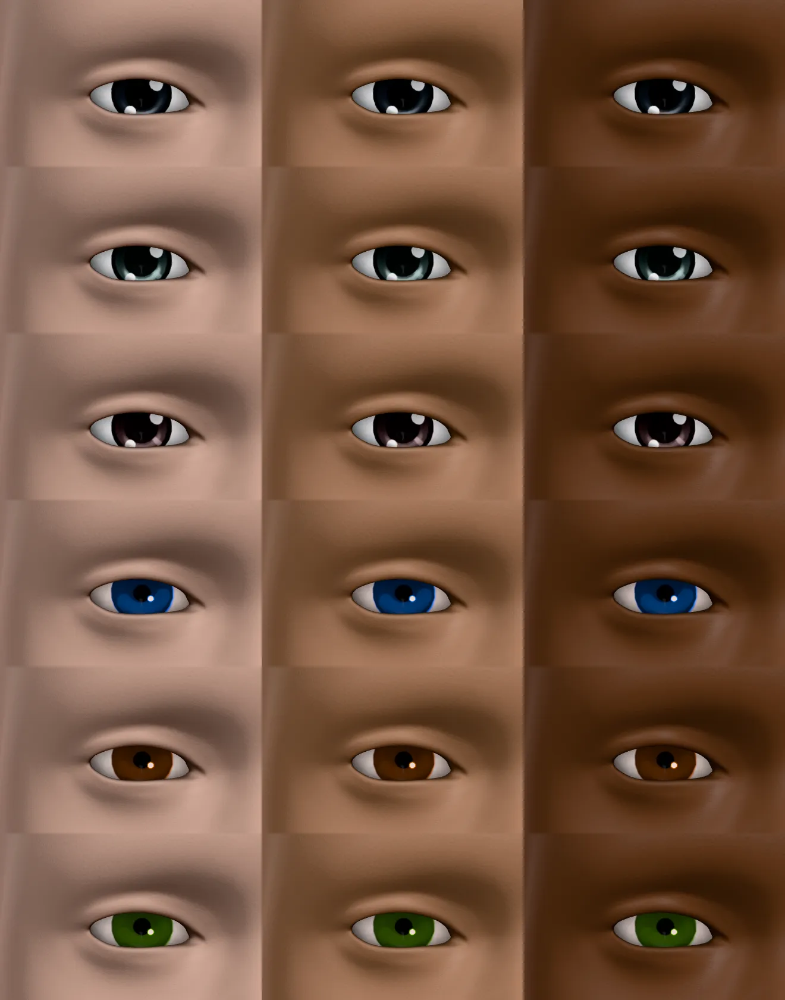
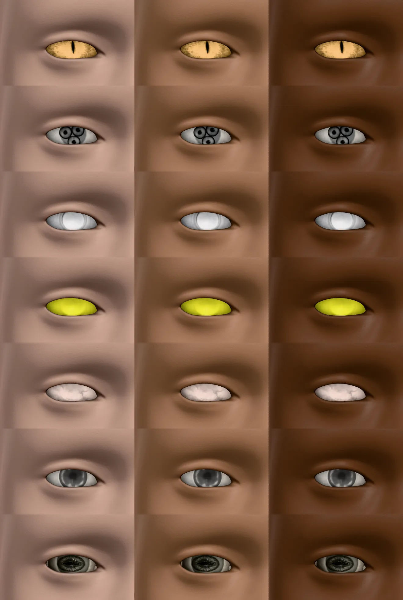
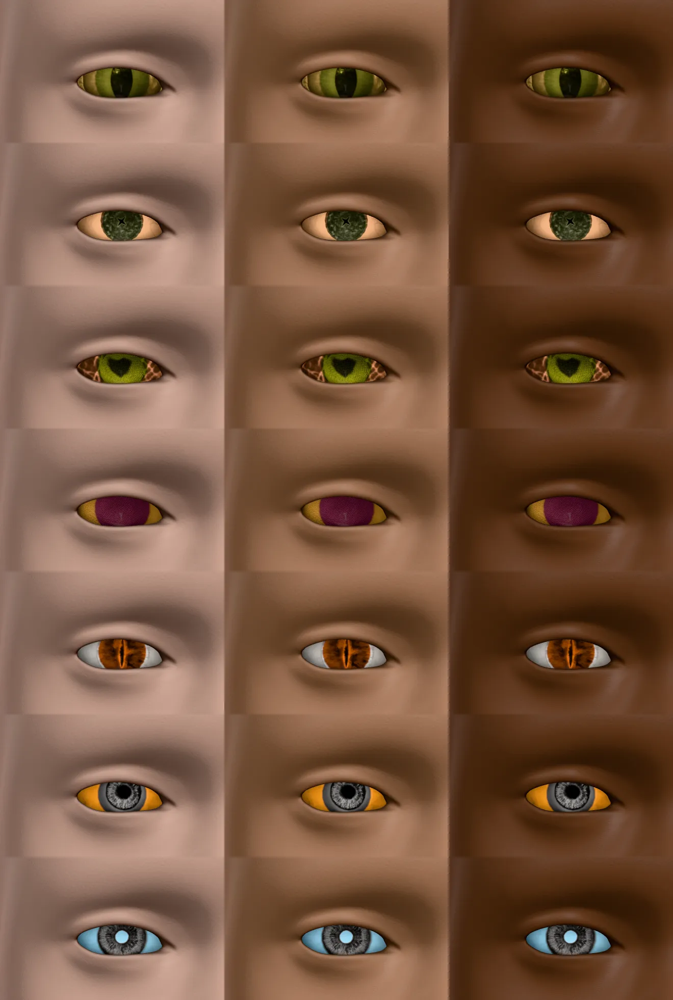

# Eye materials

The 32 CC0 materials of the MakeHuman community's `system_eye_materials01` and `02`
as the eye pack (`humanoid-kit-eyes`), worn on the eye shader's own colours
(`docs/ARCHITECTURE.md`, "Attachment colour", "Eye materials"). Every sheet is the
integrator's render through `hk-sheets` on 2026-10-09: one eye (the figure's right)
filling each cell, at skin tones `melanin` 0.05, 0.35 and 0.8 left to right, age 30; the
numbers cite `tests/eyes.test.ts`.

## One colour model, any pattern

*Top left: the built-in eye. Then amber, blue, grey, hazel, sea breeze, Mindfront's
brown and Nyloseth's sapphire, all with the recipe's own iris colour (the default
brown).* The materials differ in fibres, limbal ring, pupil and the veins of the
sclera, and not in colour: the iris stays the recipe's brown. That is the colour
model's point. The recipe's `eyes.iris` is the iris's mean colour, as it is for the
built-in texture: the shader multiplies the texture's luminance by a gain measured
from its pixels (`irisGain`: the built-in iris's mean luminance over the
material's, in the same ring of the iris), and a test (`keeps the colour model`) holds
every human, cat and toon material's iris to within 15 % of the built-in's mean
brightness. Nothing is pasted from the texture's own colour.

## Human materials, as painted

*Rows: `bobby_03`'s amber, blue, grey, hazel and sea breeze, then Mindfront's brown,
at three skin tones.* Setting the recipe's iris to a material's
`paintedIris` (measured from its pixels) shows the iris in the colour the texture was
painted in, with its pattern intact; the sclera takes the material's measured tint
(Mindfront's is warm and cream, the `bobby_03` set's within 5 % of neutral).
The lids' shadow, the lashes' line and the skin are the same at every tone.

## Slit pupils

*Rows: blue, brown, green, sapphire and yellow cat eyes (`nyloseth_*`), in their
painted colours.* The vertical slit, the iris's fibres and the limbal ring are the
material's; the colour is the recipe's.

## Toon and anime

*Rows: three anime eyes (navy, blue, red, from the CC0 "Maid-san" model), then
WojackOWL's blue, brown and green toon eyes.* The painted catchlights stay white (a
bright, grey spot inside the iris is drawn as sclera, which a chroma mask would have
coloured) and the iris is a flat disc to the material's measured radius. The anime
textures are opaque everywhere, so the cornea's cut (the transparent disc of the
texture that the cornea dome maps to) is taken from the built-in texture's alpha;
without it the dome is drawn over the iris and the eye reads as a white ball.

## Creatures

*Rows: Daz dragon, six eyes, hero white, hero yellow, zombie, blank and the second
alien.*

*Rows: the first alien, cross, the two facette eyes, reptile, orc and trans.* A
material with no iris edge to measure (`hasIris: false`, the hero yellow, the zombie's)
is all sclera detail, shown in the material's measured tint: a glowing yellow eye, a
marbled pink one. Where a creature's identity is its colour the sclera tint and the recipe's iris
carry it (set `eyes.iris` to the material's `paintedIris` for the painted look); the
skin patterns Hatshj painted around the eyes are not on the eyeball and do not show.

## What is measured and what is not

Every number in the manifest is measured from the pixels: the iris's radius, the
iris and sclera gains and tint, the iris colour as painted (`measureEye`). The two
iris centres are the built-in texture's (a test checks them against its pupils),
shared by every material. A few materials were painted for the low-poly eye mesh
(`culturalibre_6_eyes`, `culturalibre_hero_yellow_eyes`) and are shown on this one as
they fall: usable, not exact.
