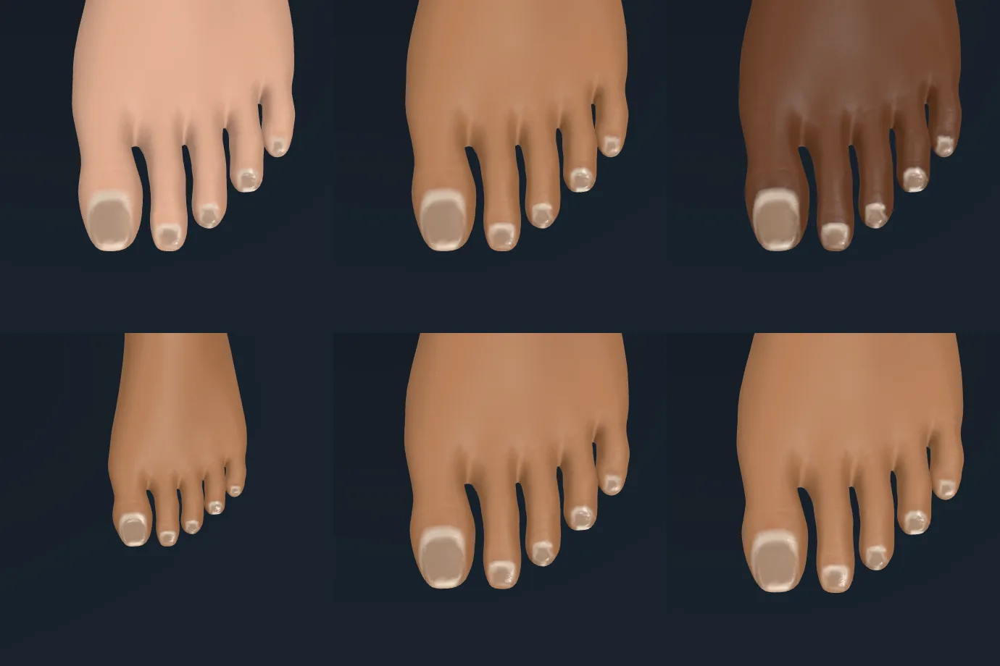
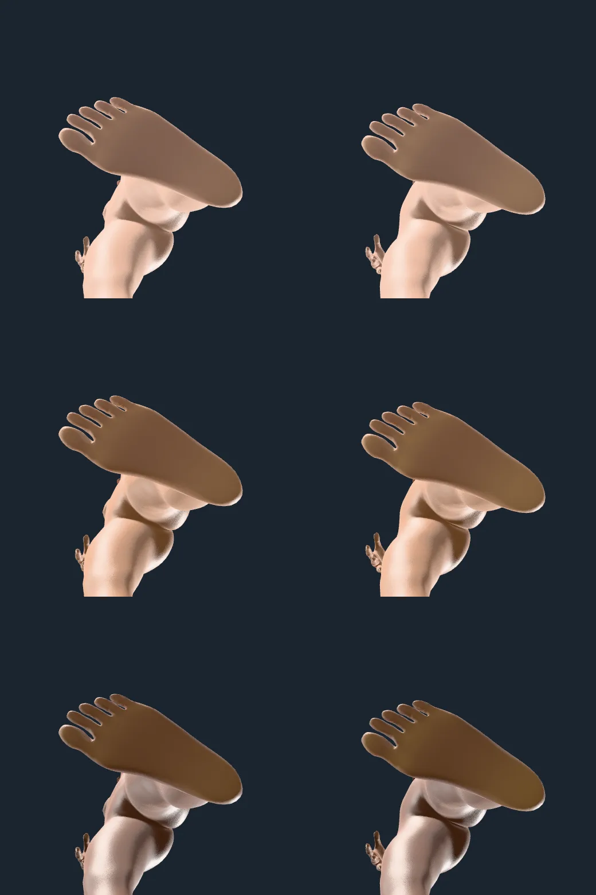

# Feet: evidence

Contact sheets of the feet's own skin, rendered through `hk-sheets` from the
playground with `?frame=` (the camera aims at a bone by name) on 2026-10-09. What
each layer is and where its numbers come from: docs/ARCHITECTURE.md, "Feet", and
docs/research/SKIN-STATES.md, C6.

## Toenails

`frame=toe2-2.L&view=0,1,0.35&span=0.12`. Top row, age 30 at melanin 0.2, 0.5 and
0.9; bottom row, melanin 0.5 at ages 6, 60 and 85. The nail is the hands' model:
`nailStops` along `nailCoordinate`, painted on the same layer as the fingernails
(`knuckles-nails`) with the same gloss layer. Each nail lies on the top of its toe's
end, the big toe's the largest with its fold and free edge; the lesser toes' edges
are coarse because a nail is a few vertices on the 5 mm mesh. The little toe's nail
was once painted on the wrong side: the skeleton's line runs near that toe's upper
surface, so `under` is now taken from the middle of the toe's flesh.

## Callus

The left sole from below at exposure 4, age 30 then 80, at melanin 0.2, 0.5 and
0.9, lit from below. Callus is a mix toward the sole's colour (the palm's measured
colour, `palmAlbedo`) made paler and yellower (+9 L\*, −3 a\*, +8 b\*), by `callusAmount(age)`
of 0.85 at the heel pad, the ball and the big toe's pad; it reads as a lighter,
yellower area there and is stronger at 80. It is subtle by design: at 30 the shift
over the sole is 0.55 × 0.85 of 9 L\*.

The sole is lighter than the body's skin at every tone but the lightest, as the
palm's is (sole L\* minus skin L\*: −1.7 at melanin 0, +1.0, +3.6, +7.9, +13.3, +15.5
and +18.2 at 0.15, 0.3, 0.5, 0.7, 0.85 and 1: the hands' measured palm against the
back of the hand).

## Not drawn, and limits

- A matte surface on callus, yellowing of old toenails and age scaling of the
  toes' wrinkles: the layers are shared with the hands' to hold the atlas at eight
  pages, and their paint has no place for them.
- The friction ridges (0.45 mm) show only at a macro distance under raking light
  (a heel from 14 cm at 1200 px); they fade out below about three pixels a period.
