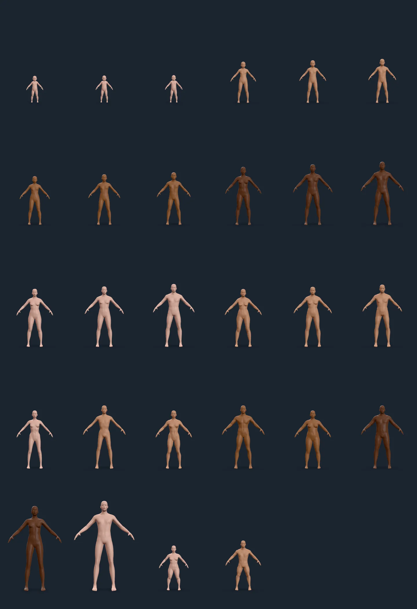

# Figure permutations

Left to right, top to bottom:

1. age 3, gender 0
2. age 3, gender 0.5
3. age 3, gender 1
4. age 9, gender 0
5. age 9, gender 0.5
6. age 9, gender 1
7. age 14, gender 0
8. age 14, gender 0.5
9. age 14, gender 1
10. age 25, gender 0
11. age 25, gender 0.5
12. age 25, gender 1
13. age 50, gender 0
14. age 50, gender 0.5
15. age 50, gender 1
16. age 85, gender 0
17. age 85, gender 0.5
18. age 85, gender 1
19. lean, gender 0
20. lean, gender 1
21. muscular, gender 0
22. muscular, gender 1
23. heavy, gender 0
24. heavy, gender 1
25. tall, gender 0
26. tall, gender 1
27. short, gender 0
28. short, gender 1
