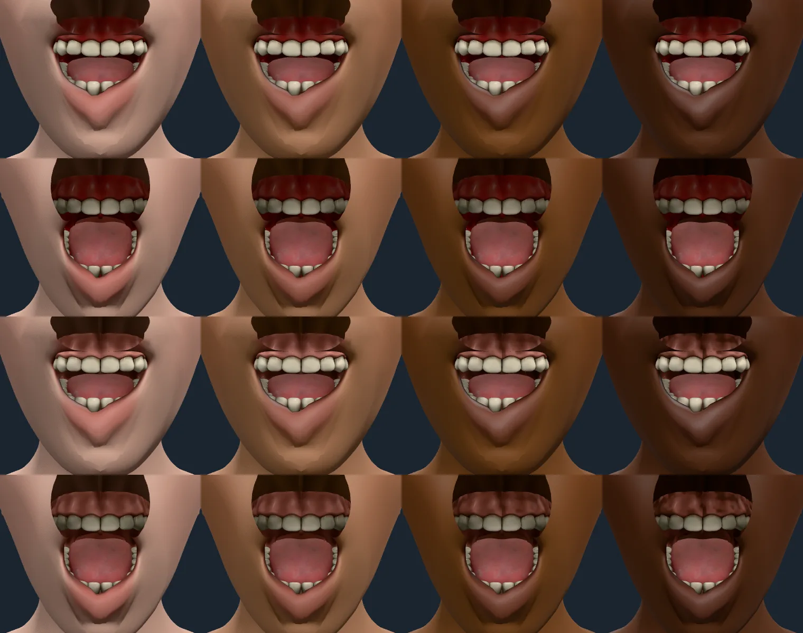

# The gums

Rendered on 2026-10-09 with `scripts/contact-sheet.mjs`: melanin 0.05, 0.35,
0.7 and 0.95 left to right; the first row of each pair is a smile with the jaw
dropped to 0.45, the second is `JawDrop` at 1. The default set, so the tongue
is in the mouth.

**Before.** The ring of gum round the teeth, and the gum's pieces behind them,
were a saturated, almost pure red at every tone (the sampled gum is sRGB 66, 13,
7 at all four). Real gingiva is a paler coral pink, and on deeper skin it is
pigmented with melanin, darker and patchy.

**Cause.** The teeth fix (`docs/evidence/teeth.md`) multiplies the whole teeth
texture by the colour that brings its tooth texels to enamel. The texture's gum
texels are MakeHuman's dark saturated red (mean linear 0.195 / 0.039 / 0.045),
so the same lift made them the red above.

**Fix.** Teeth are drawn by a `TeethMaterial` that recolours the gum texels
(`src/render/attachmentLook.ts`, `src/surface/gumTone.ts`; ARCHITECTURE.md,
"The gums"). A gum texel is told from a tooth texel by its saturation (the
texture's texels form two groups, the tooth under 0.3 and the gum over 0.5), keeps
its luminance, so the creases painted into the texture survive, and takes
`GUM_LAB` (L\* 70, a\* 24, b\* 16, a pale coral pink), mixed toward the browner,
darker `GUM_PIGMENT_LAB` by `gumPigmentAmount(melanin)` in patches of a smooth
noise: none up to melanin 0.25, 0.85 of the gum at 1, about a fifth of that
between patches. Tooth texels are untouched.

**After.** On light skin the gum reads as a dusty coral rose, shaded by the lip
over it as a real gum is; at melanin 0.7 and 0.95 it turns brown and
blotchy, most plainly in the jaw-dropped rows. No tooth carries
pink: a first version that told gum from tooth by the difference between red and
green coloured a few bright, slightly warm tooth texels, and a test now holds a
bright warm tooth texel at enamel.

**These values are a choice, not a measurement.** "Coral pink" and "brown patchy
melanin pigmentation, more on deeper skin" are the periodontology descriptors of
healthy gingiva (the pigmentation is graded clinically from none to heavy on the
Dummett oral pigmentation index), but no table of colorimetry from them ships in
this repository. `GUM_LAB` is lighter than a gum in a lit mouth (L\* 55 to 65)
because the mouth's own occlusion shades the ring round the teeth to about half
before it reaches the screen; the pigment's L\* 35, a\* 12, b\* 13 and the curve
are picked to read right beside the lip and skin colours (`lipAlbedo`).
