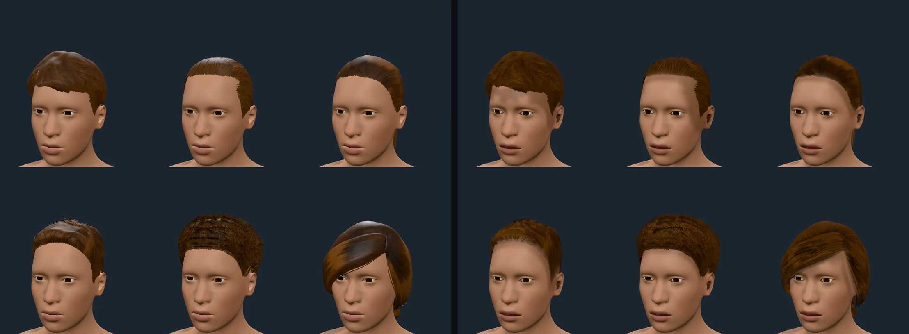
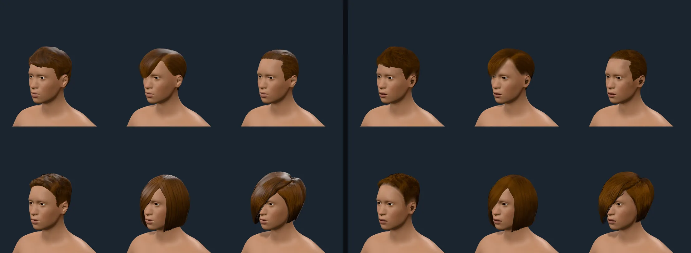
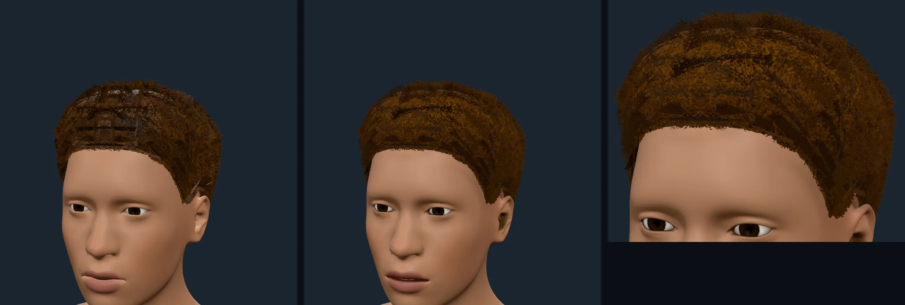
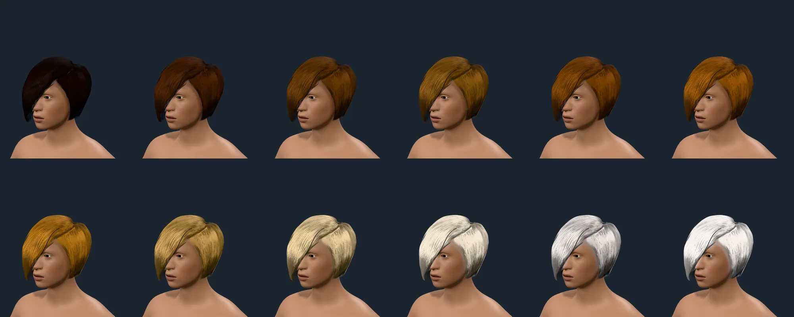

# Scalp hair

`humanoid-kit-hair` in the playground, 2026-10-09, DPR 2, the brown default colour unless a sheet
says otherwise. Each pair is **before** (left: hard card edges, one smooth highlight, the atlases'
own blotches) and **after** (right). Sheets are made by `scripts/contact-sheet.mjs` and read, not
just taken.

## Hairlines

Styles, row by row: `short02`, `short04`, `ponytail01`; `short01`, `afro01`, `braid01`.

- Before, every hairline was a cut edge: a helmet, or a wig, with bare skin to the line.
- After, `short04`, `ponytail01` and `short01` thin into the scalp over about a centimetre. The
  card dithers away by a per-vertex fade (`src/surface/hairFields.ts`, `HairMaterial`), a
  discard that needs neither MSAA nor blending, so it looks the same on SwiftShader. The skin
  under the hair is tinted toward the hair's colour where the style grows (`SkinMaterial.setScalp`),
  so the thinned line shows a stubble shade and not bare skin.
- `short02` keeps a hard lower edge on purpose: it is a fringe, hanging more than a centimetre off
  the forehead, so no card edge of it meets the scalp and none is feathered. The tint under it is
  confined to within 8 mm of a card for the same reason (a wider tint read as a stain on the
  forehead).

Styles: `short02`, `short03`, `short04`; `short01`, `bob02`, `bob01`.

## The afro, and the braid

The afro's net had two causes, and neither was the source texture alone:

1. The atlas carries painted-in dark cells. The packer now divides them out for `afro01` and
   `braid01` (`strandMapFromRgba({ flatten })`; `braid01`'s dark blotches go the same way, visible
   in the bottom-right cell of the front sheet above).
2. The style stands about 340 loose curl cards out of its cap, which look like a lattice of dark
   slivers when seen edge-on. A card standing out of the scalp is a "fin" (a per-vertex measure,
   `HairFieldData.fin`) and fins dither away as they turn from the eye; the cap's own cards never
   do. Feathering every card edge near the scalp, the first attempt, cut the afro into the same
   lattice; edges another card lies well over are now excluded from the hairline.

3. The first after-sheets still read poorly: card bands, speckle where the dither thinned
   fins, and flat dark patches where overlapping cards darkened each other. The fade and the
   fin angle are now the card's coverage under alpha-to-coverage (a smooth gradient, no speckle;
   the dither remains for contexts without it), occlusion is a smooth height-above-the-scalp
   gradient the ray bake only modulates, and the afro opts out of the hairline fade (its roots
   showed the dark inside of the volume as a band).

The scalp tint is also limited to under the hair the texture leaves (it had painted a flat
patch over the temple and cheek past the visible hairline) and is built from the skin's own
colour, so white hair paints no pale patch on deep skin.

Left: before. Middle: after. Right: after, closer. A few darker curl clumps remain in the
afro's texture.

## Shading

The highlight is two Kajiya-Kay lobes along the strands, low and wide: a faint white one shifted
toward the tip and a broader one in the pigment's colour shifted the other way, with the strand
map's brightness moving the shift so the band breaks into strands. Roughness falls with the
strand coherence (frizz 0.95, combed 0.7) and the base specular is scaled to 0.4. The first
intensities read as glossy plastic patches on the bobs and side-swept styles; these do not, at any
of the twelve colours. The tangent is the gradient of the baked growth, so short styles have a
highlight across their strands as long ones do. A browser test bounds the worst pixel of a sphere,
at any strand direction and light, to three times its diffuse (broken, a mirror-like lobe reads
twelve times); browser tests also measure the lobes' band shape (wider than tall for strands
growing upward, the reverse along x, none without a growth gradient).

## The coverage gap

The ten styles are every scalp hair the system pack's CC0 header proves, and they are nearly all
straight or wavy. **Coily and kinky textures are missing**: locs, twists and many-braid styles,
cornrows, bantu knots, tight curls other than the one afro, and a close crop, taper or fade.
`afro01` is one short style; `short01` is a crop of loose curls; `braid01` is a straight-textured
side braid. The pack must not be presented as complete.

Tier-2 candidates, from the sourcing catalogue (`mhclo` and `obj` both carry `license CC0` and no
sibling file contradicts it, so the licence can be proved from the file):

| Candidate | What it is | Closes the gap? |
| --- | --- | --- |
| `toigo_blunt_bob`, `toigo_curled_under_bob`, `toigo_inverted_bob` and their `_with_bangs` twins (six) | Sculpted bobs, 1,507 to 2,670 vertices, 3600 px textures, one colourway each | No: straight and curled-under bobs |
| `faydaen_hair_1` | An opaque 512 x 1024 sculpt; licence line is the exporter's default (`author: unknown`), weak evidence | No: straight, and ranked last |

The community styles that are coily or braided fail the gate **as it stands**: `o4saken_curly01`
and the `elvs_*` braids are CC-BY or AGPL in the file (the asset page claiming CC0 does not
count), and `culturalibre_hair_05/06` say CC0 in the `mhclo` and AGPL3 in the `obj`. A file's
licence line can be stale after MakeHuman's cutover to CC0, and that is being re-verified with
dated evidence (licence history), so these are **pending licence-history verification, not
rejected**. Until one is proved, closing the gap needs an authored or procedural coily style:
curl cards or strand clumps over the same growth, fade and scalp fields. It is not in this
milestone and the creator offers none.
