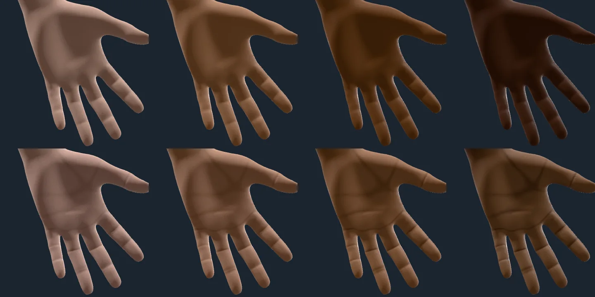
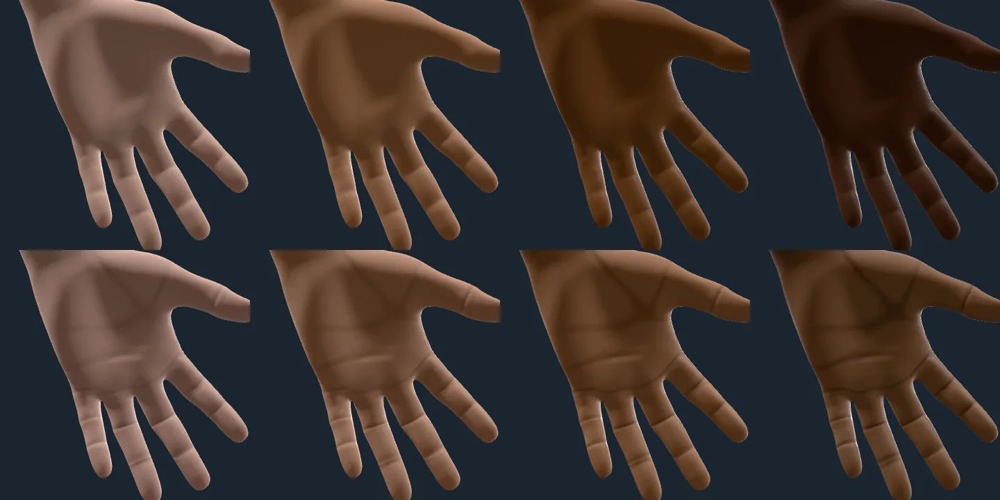
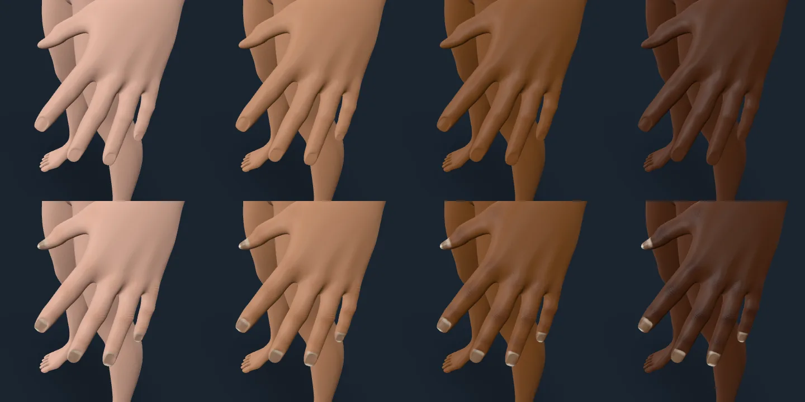
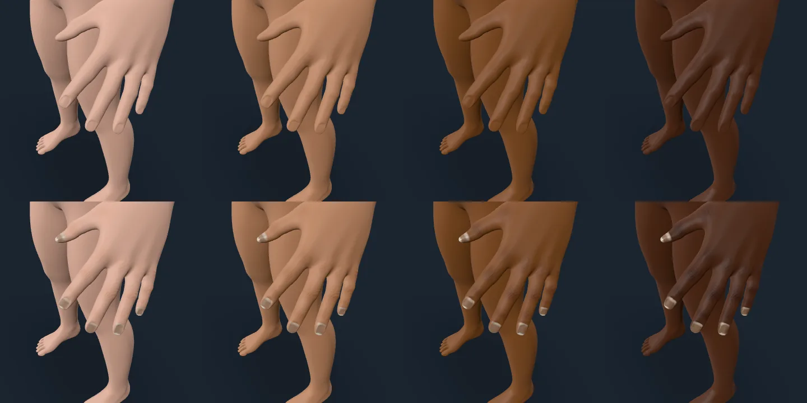

# Hands

Rendered on 2026-10-09 with `scripts/contact-sheet.mjs` against the playground:
the default figure on the studio stage, nothing changed but the skin's melanin
(0.05, 0.35, 0.7 and 1, lightest to deepest, left to right) and, for the child,
the age (8). Each sheet has two rows: before (the base this branch started
from) above, after below. Sources and choices for every magnitude are in
`docs/research/SKIN-STATES.md`, A6 and C5; the design is in
`docs/ARCHITECTURE.md`, "Hands".

The palms face away from the studio's key light in MakeHuman's rest pose, and
the playground cannot turn the hand, so the palm sheets are taken from the
palm's side at exposure 2.2 (the backs at the studio's default). The palms are
lit only by the environment, so judge their colour against each other and
against their own row, not against the backs' sheets.

## Palms, adult

Before, the palm is the back of the hand's colour at every tone, so the
deepest hand has a palm as dark as its back. After, the palm's lightness
barely follows the skin's (the archive's paired palms: L\* 48 on the darkest
backs of hands to 67 on the lightest), so the four palms are close to one
another while the backs span the whole range, and the deep palms are yellower,
as measured. The creases (the three of the palm, and each finger's) are lines
of colour finer than the mesh plus a broad relief fold; on deep skin the line
is the skin's own colour coming back, on fair skin a shade only.

## Palms, child

The same layers on an 8-year-old: creases form before birth, so their places
are the adult's, scaled with the hand. The palm's colour follows the same
measured bins (no child palm colour was found measured).

## Backs of the hands, adult

Nails: the bed is measured nail colour whose lightness follows the skin's at
0.15 L\* per L\*, so on deep skin the nails are much lighter than the fingers,
and on fair skin a little darker than them; the lunula is a little whiter, the
free edge keratin white, the plate glossier than skin. Knuckles: more melanin
multiplied over each finger joint, so fair knuckles barely change and deep
ones darken; and wrinkle arcs over the middle and end joints and the
knuckles, which read at this distance on the deeper tones and on fair skin
mostly in the highlight.

## Backs of the hands, child

## Limits

- The nail colour is one cohort's (67 Japanese adults, mean age 68): beige
  rather than pink, as older nails are. Young adults' and children's nail beds
  are pinker and unmeasured here; so are lunula size, the free edge's colour and
  nail gloss (choices).
- Knuckle colour and wrinkles, crease width and depth, and the crease line's
  pigment on deep skin are choices: nothing measures them by tone (A6).
- The palm's colour stands the figure's skin in for the back of its hand; the
  skin model's anchors are facial readings.
- Relief is a close-up effect: crease folds and knuckle wrinkles fade where they
  are finer than a pixel, so a full-length figure shows the palm's colour and
  the crease lines but not their relief.
- No finger flexion is measured by the rig, so the knuckle wrinkles do not
  flatten as a finger bends; children's hands get the adult's crease and
  knuckle patterns at their own scale (no age reaches a layer's paint).
- Soles are left to the feet's area (no sole colour was found measured).
