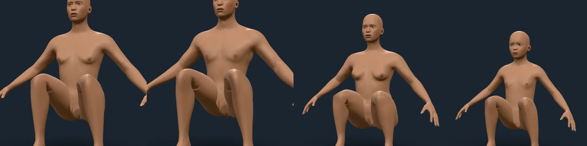
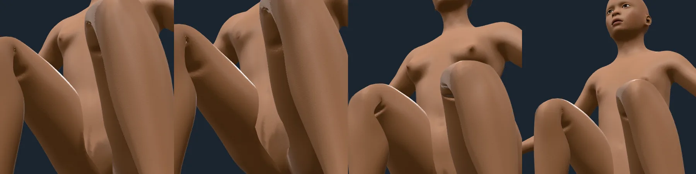
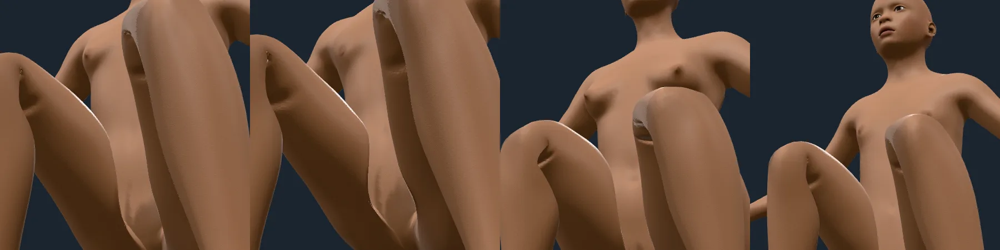

# The hip fold

Rendered on 2026-10-09 by the integrator's shared sheet pass against the
playground, on the studio stage. The pose is `tucked` (each hip flexed 120°, the
knees drawn up), on the average adult, a muscular man, a short full woman and a
ten-year-old. How the fold is made and measured is in `docs/ARCHITECTURE.md`,
"The hip fold".

## Before: the thigh through the belly

At 120° the skin at the front of each thigh passes into the belly (94 mesh edges
of the average figure cross the trunk's skin, up to 30 mm deep) and the groin
collapses into a slit with jagged teeth at the inner upper thigh.

## After: the fold

The thighs lie against the belly and no longer pass through it (11 edges still
cross, none with the thigh behind the belly's skin; the unit gates hold the thigh
under 2 mm behind the belly's skin at every flexion in nine bodies). The skin's
normals follow the displaced surface: before they did not, and the cut under the
fold's lip was shading of skin the fold had removed.

## What is not right yet

The groin is a fold, not yet a soft one. A pale, sharp-edged lip runs along the
inner upper thigh where the pushed-out skin meets the belly, in every body. Of
the edges in the contact band, 56 to 129 at 120° meet at over 60° where 4 to 12
did without the fold, and a few double back. The push-outs are about 4 cm along
smooth directions, but the seam's triangles are 2 cm across and pinned to the
trunk, so they flip when the corner beside them moves that far in their plane.
Smoothing the displacement, easing the hip back along arcs and letting the seam
follow were tried and made it no better (`ARCHITECTURE.md`). A solve in which
the belly gives as well, the next step, needs the trunk's skin to be displaced
consistently.
