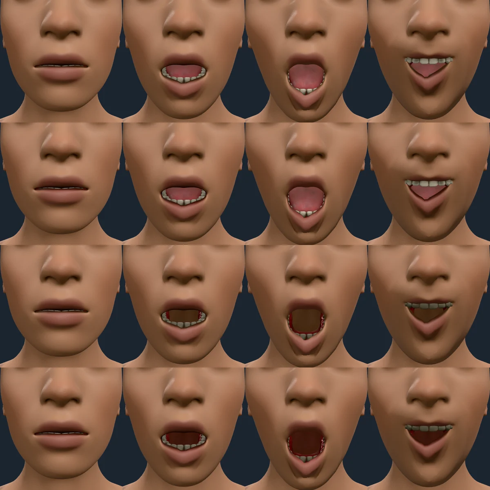
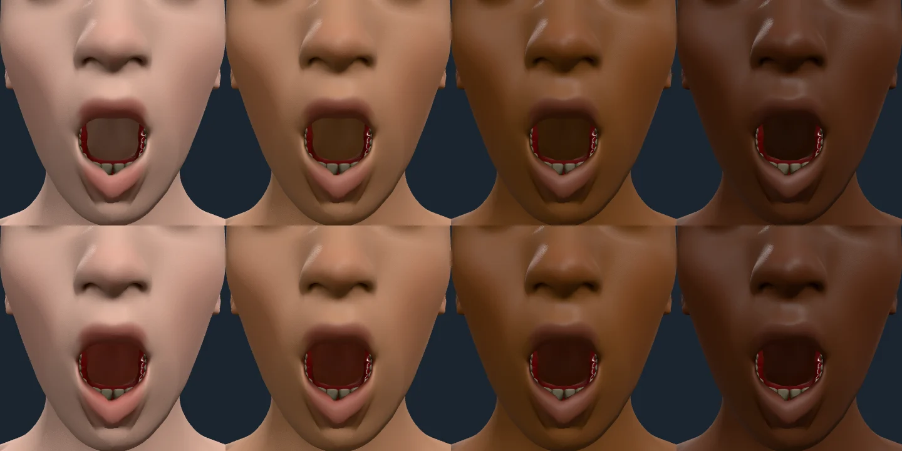

# The mouth's lining

Rendered on 2026-10-09 with `scripts/contact-sheet.mjs`. Columns: rest,
`JawDrop` 0.5, `JawDrop` 1, and `JawDrop` 0.6 with both mouth corners pulled up.
Rows 3 and 4 wear `?wear=teeth/base,eyes/high-poly`: no tongue.

**Before.** After the cavity occlusion (`docs/evidence/occlusion.md`) the inside
of a tongueless mouth was dim but still the colour of the skin around it: a
brown wall behind the teeth. Inside the lips the surface is mucosa, red where
skin is tan, and the lip layer stopped at the lips' volume.

**After.** The mouth's lining is painted with the measured lip colour at its
deepest (`MOUTH_INTERIOR_LAYER`, `src/surface/regions/mouth.ts`), the same
epithelium over the same blood, and the occlusion darkens it by pose. The wall
the open jaw shows reads as the deep maroon of a mouth's inside, brightest at
the rim where the lips' inner edge catches light and darker as it recedes. With
the tongue in (rows 1 and 2) the tongue and teeth are unchanged and only the rim
and the floor around them turn red.

Melanin 0.05, 0.35, 0.7 and 0.95, full jaw drop, no tongue. The lining follows
the tone as the lips do (`lipAlbedo`), so it is a deep red on light skin and a
dark red-brown on deep skin, and stays redder than the skin around it at every
tone (a test holds its hue and a\* above the skin's at five tones).

**How the lining is found** (docs/ARCHITECTURE.md, "The mouth's lining"). No new
targets: seeds are the vertices the closed lips enclose (the body's occlusion at
rest) inside a box the lip joints place, and the lining spreads along the mesh's
own edges to the pocket's far end, down to the pharynx wall 11 cm behind the
lips that the open jaw shows. A first version that used the occlusion alone
lined only the rim: the far end's enclosure is partial because the mesh leaves
the pocket open, so rays leave through it. Spreading near the lips passes only
through enclosed vertices, which keeps it off the chin's outer skin.

**Known limit.** A custom attachment set (`?wear=...`) carries its closed-mouth
occlusion until `client.posedOcclusion()` has baked its corners, so the teeth in
rows 3 and 4 render dim; that is the attachments' own behaviour
(`docs/evidence/occlusion.md`), not the lining's.
