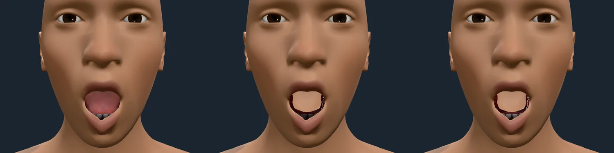
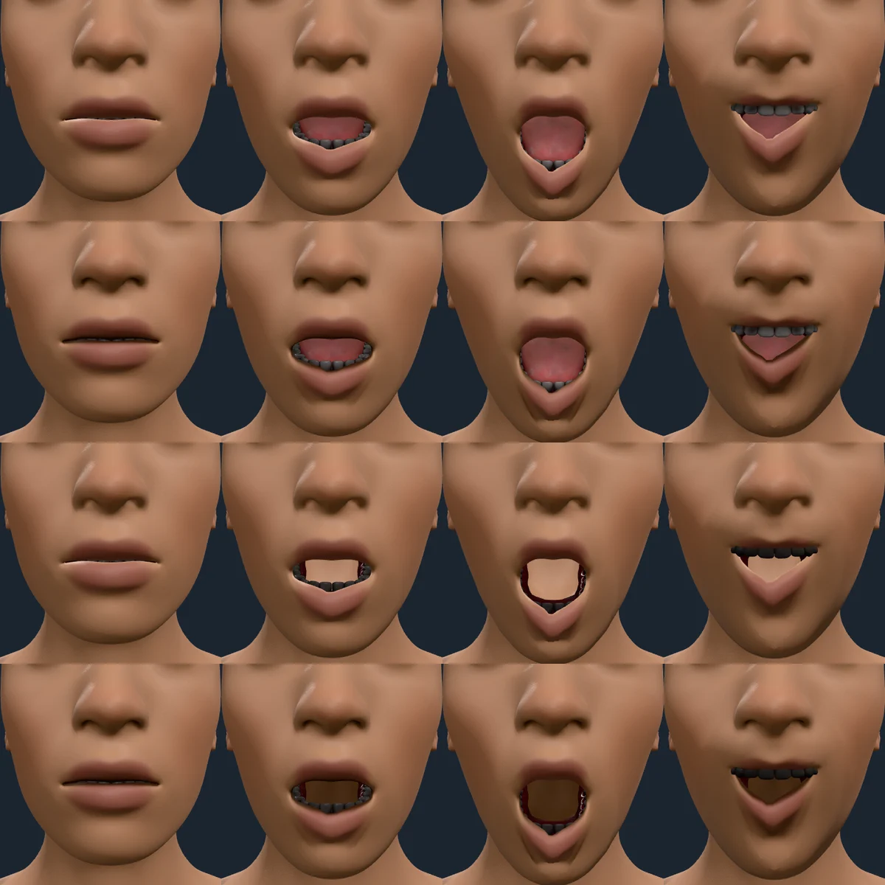
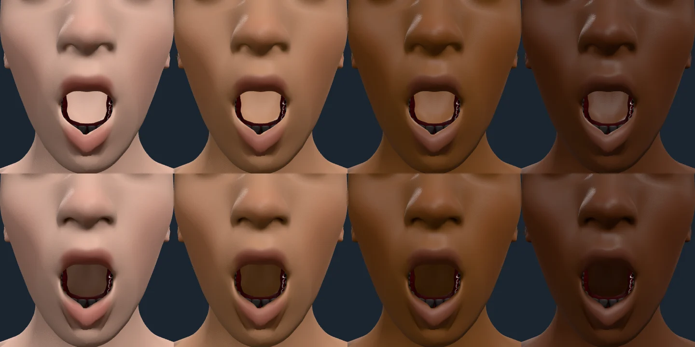
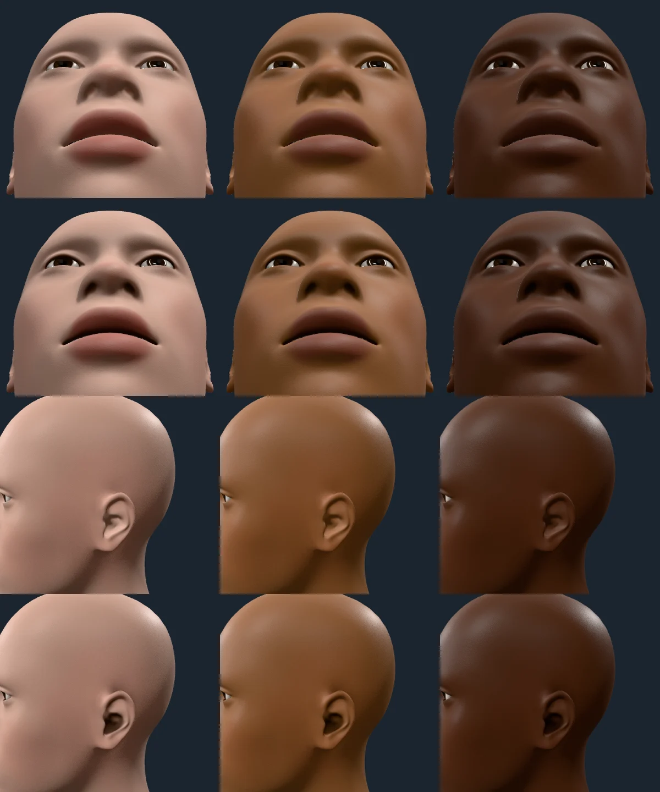

# Occlusion that follows the pose

## Attachments

`JawDrop` at 1, close on the mouth, 2026-10-09.

1. The body pack's own attachments (eyes, teeth, tongue), with the pack's
   baked corners: the tongue and lower teeth uncovered by the open jaw are lit.
2. A custom set (`?wear=teeth/base,eyes/high-poly`) just after `ready`. It is
   baked at rest only, so the uncovered teeth still carry their enclosed,
   closed-mouth occlusion and render dark.
3. The same set once `client.posedOcclusion()` has baked its corners in the
   background: the uncovered teeth are lit as in 1.

**Finding (resolved below).** Without a tongue (2 and 3), the inside of the
mouth rendered as a flat, fully lit, skin-coloured wall. Occlusion was baked
for attachments only, never for the body's own surface, so the oral cavity was
never darkened. The pack's tongue hides it in 1, but any set without a tongue,
and the cavity behind and above the tongue at wider openings, showed it.

## Body: the mouth, nostrils, ear canals and eye sockets

The body now carries the same pose-keyed occlusion for its own cavities
(ARCHITECTURE.md, "Body occlusion"). 2026-10-09, `humanoid-kit-body` with
`body-occlusion.bin.gz`: 2,288 base vertices stored, 9.2 KB gzipped.

### The mouth, with and without a tongue

Rows, top to bottom: the default set before, the default set after, a set
without a tongue (`?wear=teeth/base,eyes/high-poly`) before, and the same
after. Columns: rest, `JawDrop` 0.5, `JawDrop` 1, and `JawDrop` 0.6 with both
mouth corners pulled up.

- Without a tongue (rows 3 and 4) the wall behind the teeth was a lit, flat
  skin tone, nearly twice as bright as the cheek beside it (mean luminance 147
  against 80 in the full-jaw frame). It is now a shaded interior at about half
  the cheek's luminance (44 against 85), darkest at its rim and where the lips
  close, and it brightens as the jaw drops.
- At rest (column 1) the lip line and the nostrils close to the floor.
- With the tongue (rows 1 and 2) the tongue and teeth are exactly as before,
  since they carry their own occlusion; only the skin around them changes.
- The lip-chin crease under the lower lip keeps its plain value. Applying the
  cavity curve to every stored vertex was tried first and left a dark smudge
  there at every jaw opening; the exponent now follows how enclosed a vertex
  is at rest, so only true cavities take the steep curve.

### Skin tones

Melanin 0.05, 0.35, 0.7 and 0.95, full jaw drop, no tongue; before above,
after below. The cavity darkens the lit skin, so it keeps each tone's hue and
stays dim, not black, at every tone, from the lightest to the darkest.

### Nostrils and ear canals

Melanin 0.05, 0.5 and 0.95; rows top to bottom are the nostrils before, the
nostrils after, the ear before and the ear after. The nostrils now read as
openings and the ear's canal and concha as a shaded hollow, not lit skin; the
eye sockets, which the eyeball fills, darken behind the lids.

### What is still open

The mouth's wall remains a skin-coloured surface: it is darkened, not tinted
the red of mucosa, and the mesh ends the pocket a couple of centimetres behind
the lips, so a wide-open mouth with no tongue shows a wall where a throat
would be. Both belong to the lips and mouth pass of the face audit.
