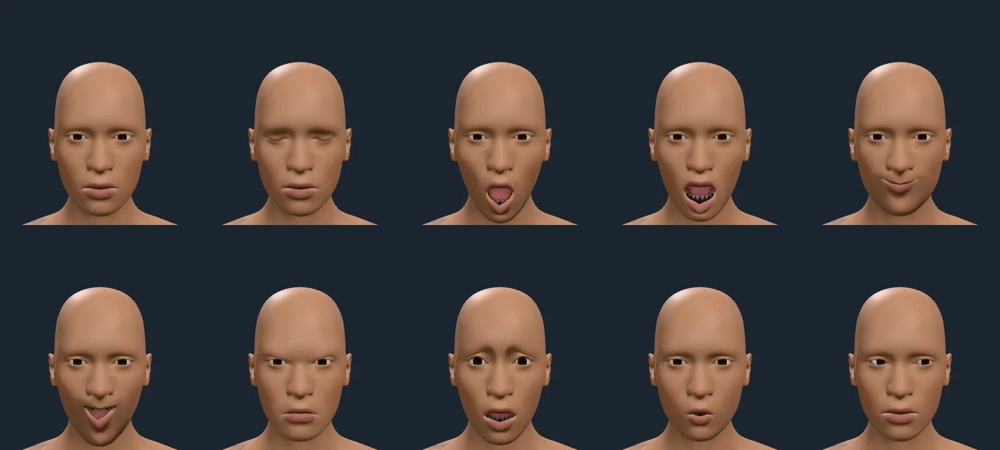
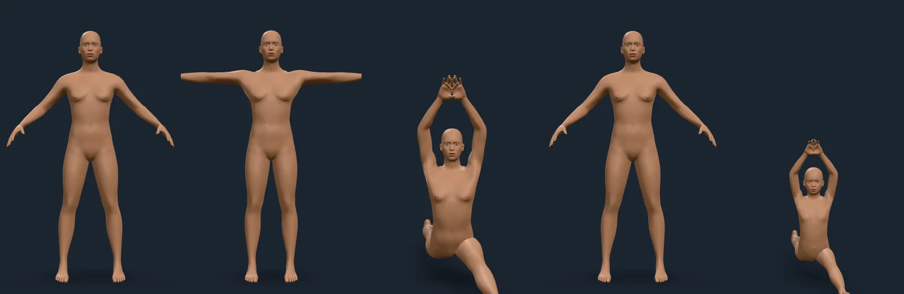

# Posing (M2)

Rendered on 2026-10-09 with `scripts/contact-sheet.mjs` against the playground,
default figure, studio stage.

## Expressions

Left to right, top to bottom (face unit weights; 1 when not given):

1. rest
2. blink: `LeftUpperLidClosed`, `RightUpperLidClosed`
3. jaw open: `JawDrop`
4. bared teeth: `JawDrop` 0.6, `UpperLipUp` 0.6, `lowerLipDown` 0.6
5. smile: `MouthLeftPullUp`, `MouthRightPullUp`, `LeftCheekUp` 0.6, `RightCheekUp` 0.6
6. open smile: `JawDrop` 0.7, `MouthLeftPullUp`, `MouthRightPullUp`
7. frown: `LeftBrowDown`, `RightBrowDown`, `NoseWrinkler` 0.7, mouth corners down 0.6
8. surprise: inner brows up, upper lids open 0.8, `JawDrop` 0.4
9. kiss: `LipsKiss`
10. gaze left: `LeftEyeturnLeft`, `RightEyeturnLeft`

Teeth and tongue uncovered by the open mouth are lit through the pose-keyed
occlusion. The uncovered teeth read dim, and that is the lighting rather than
the occlusion: at the jaw-open corner a ray from each uncovered tooth vertex
toward the studio's high key light is blocked by the upper lip for every one
of them (99 facing the key, none reached), while the low fill reaches 24 of
106. Scaling the key by their hemisphere openness (median 0.25) lets more key
light in than the geometry does, not less.

## Body poses and skin state

1. rest (MakeHuman's A-pose)
2. `tpose`
3. `benchmark`, grounded on its lowest point (the kneeling knee)
4. `cold` skin state (the nipple rises, the areola contracts; small at this scale)
5. age 9 in `benchmark`

Both poses are CC0 BVH files from MakeHuman, packed with the body.
