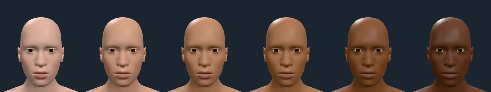
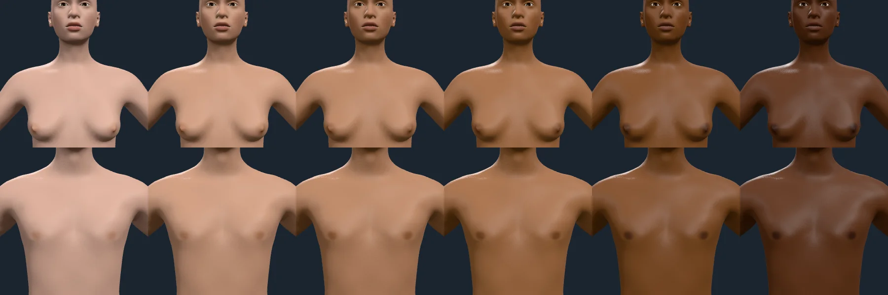
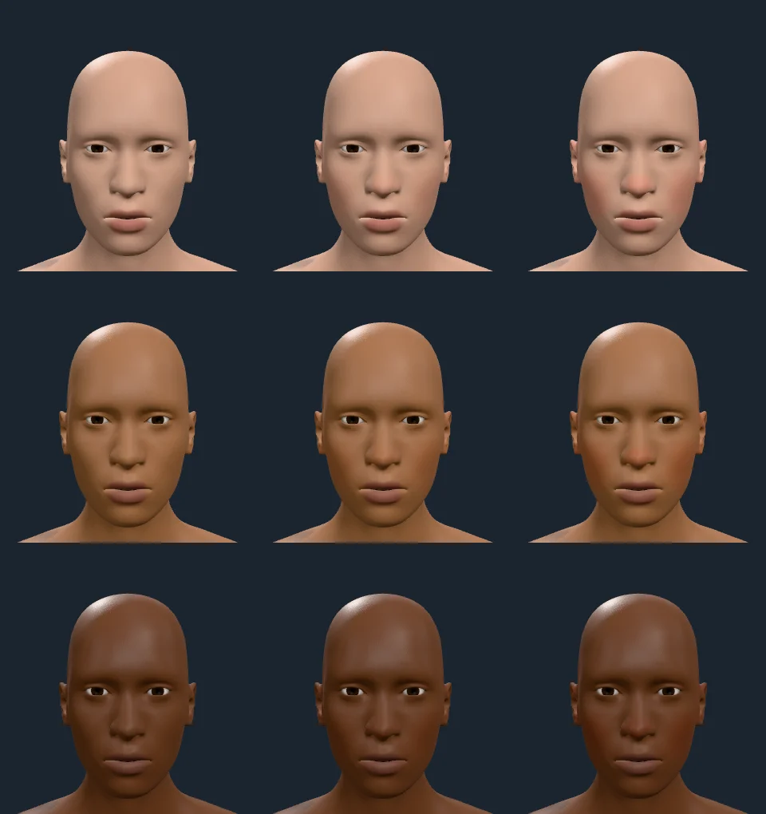

# Skin regions across tones

Rendered on 2026-10-09 with `scripts/contact-sheet.mjs` against the
playground: the default figure on the studio stage, with only the skin
changed. Melanin runs 0.05, 0.2, 0.35, 0.5, 0.7, 0.9 from left to right.

## Face: base tone and lips

Lips follow the measured lip model (ISSA lip lightness against skin, specular
included). At light tones they read pinker than the skin; at dark tones they
read lighter and greyer than the skin, as measured lips do.

## Chest: areola

Female above, male below. The first sheet of this page found two faults:

- The areola read barely darker than the skin at any tone and vanished on
  deep skin. The colour model raised the melanin parameter by a fixed step,
  which is not a melanin ratio.
- The mask drew a ring around a skin-coloured nipple. The nipple-size target
  outlines the areola rather than covering it.

Both are fixed: the areola now carries twice the skin's melanin optical density
at the default depth, and the mask fills the outlined disk (research
`SKIN-RENDERING.md` §5.6). This sheet is after the fix. The areola and nipple
read darker at every tone, deep skin included.

## Flush

Columns are flush 0, 0.5 and 1. Rows are melanin 0.15, 0.5 and 0.85. Flush
reddens the cheeks, nose and ears; melanin masks it, as haemoglobin colour is
masked in darker skin. At light tones, flush 1 turns the nose strongly red.

## What is not rendered yet

The skin-state signals `heat`, `exertion`, `blush` and `fear` are accepted by
`<Humanoid signals>` but nothing on `main` draws them. Only `cold` has a visible
effect, through its state morph (nipple and areola, `docs/evidence/posing.md`).
Their colour and relief layers (pallor, flush, sweat sheen, goosebumps) are
queued as their own work.
