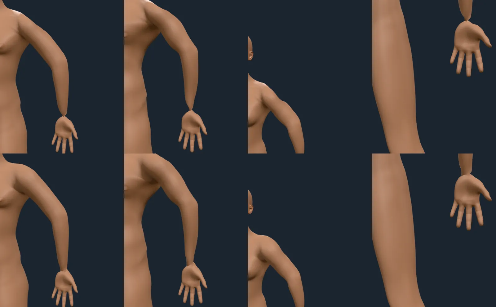
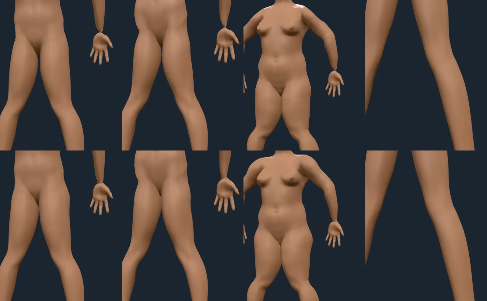
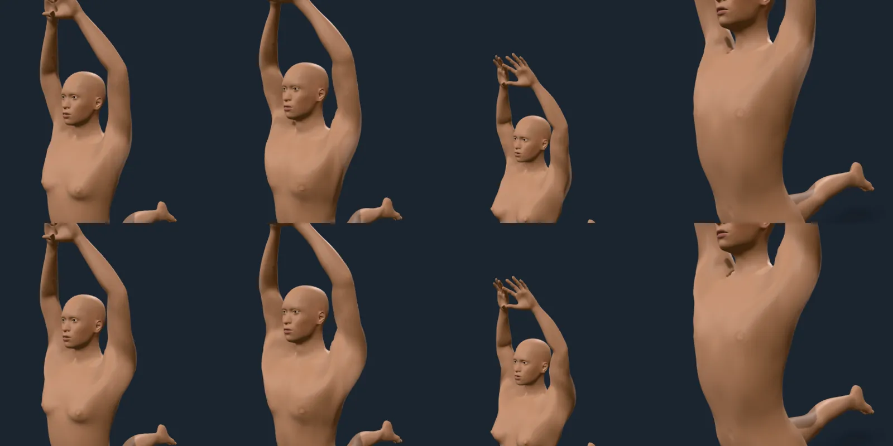
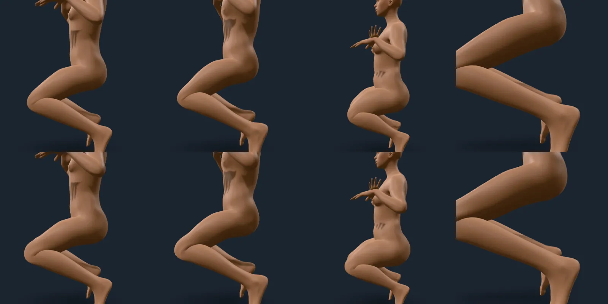
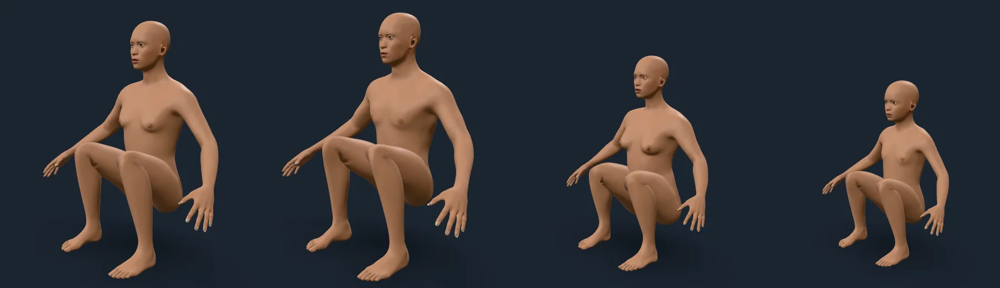
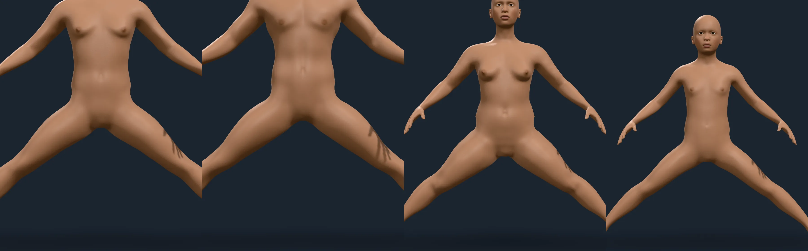
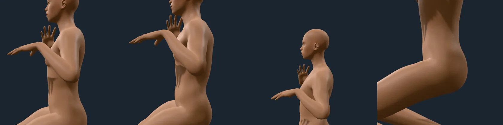

# Skinning at the joint extremes

Rendered on 2026-10-09 with `scripts/contact-sheet.mjs` against the playground,
on the studio stage, the same figures and cameras twice: linear blend skinning
alone (top row of each sheet; every bone's dual quaternion share set to zero) and
as shipped, linear skinning mixed with dual quaternions by bone (bottom row).
Four body types across each row: the average adult, a muscular man (gender 1,
muscle 0.9), a short full woman (height 0.2, weight 0.8) and an extreme tall
lean man (height 1, weight 0.1). The poses are the pack's `benchmark` and the
authored `flexed` and `twisted` (`scripts/poses/`). The numbers and how they are
measured are in `docs/ARCHITECTURE.md`, "Skinning artefacts"; the bench is
`scripts/lib/skinBench.ts` (its bodies are less extreme than the tall man here)
and its table is `node scripts/research/skinning-artefacts.ts`.

## Twisted forearm: the candy wrapper

`twisted` turns each forearm 170° about its own axis at the wrist. Linear
skinning pinches the forearm to a point where the twisted hand meets it, in
every body. Shipped, the wrist keeps its girth and tapers as a wrist does. This
is the headline fault, and the cleanest fix.

## Twisted thigh

The thighs turned 60° about their own axes. The groin of the short full woman
(third column) stays full where linear skinning draws it in; elsewhere the
difference is small at this angle.

## Arm raised overhead

`benchmark` raises both arms over the head. The armpit and the deltoid keep
their volume (muscular man, second column; tall lean man, fourth); linear skinning
draws them in.

## Hip flexed

The `flexed` pose raises the hips 60° and bends the knees. The difference here
is slight: the front of the hip is a little fuller in the short full woman
(third column), and the knee a little rounder. This is the joint that gains
least in the pictures, as in the numbers. The dark streaks on the belly in both
rows are the fingers' shadows.

## Hip tucked

Before: the `tucked` pose (each hip flexed 120°, the knees drawn up) on the
average adult, a muscular man, a short full woman and a ten-year-old. The thigh's
dual quaternion share is 1 at every flexion, and the front of the hip, where
the thigh meets the trunk, stands out in a rounded lump.

After: the share falls to a quarter by 120° of swing. The lump at the top of the
thigh is flatter and the thigh runs into the trunk (girth 95th percentile 1.35
to 1.12 at 120° in the bench, against linear skinning's 1.05). At the 90° of
the `seated` pose the two were nearly identical, as the numbers predict (1.30 to
1.20).

## Hip abducted

The `abducted` pose opens each thigh 40° from the T-pose. In all four bodies
(the average figure, a muscular man, a short full woman, a ten-year-old) the
crotch closes in a clean fold, the inside of the thighs is smooth, and the
hips' outline runs into the thigh without a step. The dark streaks on the
thigh are the fingers' shadows. (A first version of this pose had its sign
reversed and crossed the legs, which drew a hard ledge across the hips; it
was the pose, not the skinning, and a test now holds the direction.)

## Elbow flexed

The same `flexed` pose, close on the elbows (shipped skinning only: linear
looks the same here, as the numbers say). The crook folds without a pinch or a
bulge, in three figures and a close-up.

## The numbers

Worst body of five (the four above and a child) at the angle shown; girth is the
5th percentile over the joint's vertices of their distance to the limb's
centreline, posed over rest (1 is clean, 0 the collapsed neck of a candy
wrapper); ΔV is the change in the whole body's volume in thousandths of it
(1‰ is about 55 mL of an adult):

| Case | Linear: girth / ΔV | Shipped: girth / ΔV |
| --- | --- | --- |
| forearm twisted 135° | 0.87 / −1.2‰ | 0.94 / −0.6‰ |
| upper arm twisted 135° | 0.52 / −13.8‰ | 0.88 / −6.8‰ |
| thigh twisted 90° | 0.72 / −34.1‰ | 0.83 / −13.9‰ |
| arm raised forward 130° | 0.41 / −19.4‰ | 0.53 / −10.5‰ |
| arm raised sideways 130° | 0.48 / −9.6‰ | 0.67 / −4.6‰ |
| arm raised forward 170° | 0.17 / −24.1‰ | 0.41 / −14.6‰ |
| arm raised sideways 170° | 0.28 / −8.0‰ | 0.63 / −1.2‰ |
| hip flexed 120° | 0.30 / −35.2‰ | 0.36 / −24.0‰ |
| spine folded forward 90° | 0.88 / −72.6‰ | 0.88 / −71.3‰ |
| hip abducted 45° | 0.70 / −17.1‰ | 0.73 / −15.6‰ |
| knee flexed 120° | 0.22 / −6.4‰ | 0.22 / −6.4‰ |
| elbow flexed 120° | 0.33 / −3.8‰ | 0.31 / −3.9‰ |

## What is not fixed, and what needs no fix

- **The elbow** loses about 4‰ of body volume at 120° (about 0.2 L of an
  adult) in every scheme tried (linear, dual quaternion, and the blend). Its
  girth 5th percentile (0.33 against 0.31) is the inside of the crook, where
  distance to the bent centreline shrinks by geometry alone, so it is a lower
  bound rather than a pinch. The sheet shows a natural fold, and it is the
  smallest loss in the table. No corrective is built for it.
- **Hip abduction** barely moves (−17.1‰ to −15.4‰): opening the legs stretches
  the groin and the inner thigh, and the skin there is stretched rather than
  lost. The sheet shows a clean crotch and no step in the hips' outline in four
  bodies, so no corrective is built for it either.
- **The flexed hip** bulged: its front reached a 95th-percentile girth of
  1.35 at 120° (linear: 1.05) in exchange for 15‰ of volume. The thigh's share
  of dual quaternion skinning now falls as it swings, from 1 to ¼ over 120°
  (`SKIN_SWING_SHARE`), which brings the bulge to 1.12 at 120° and 1.20 at 90°
  (linear: 1.05 and 1.08) for 4‰ more volume lost (−24‰ at 120°; linear −35‰).
  A bent knee's no longer bulges past linear skinning's (the lower half of the
  thigh is linear, so the knee is exactly linear's, 1.23 at 90°): that cost the
  thigh's twist some of its volume (above). The bench holds every case's bulge
  under 1.45. The options considered, and why the blend was chosen, are in
  the same ARCHITECTURE section.
