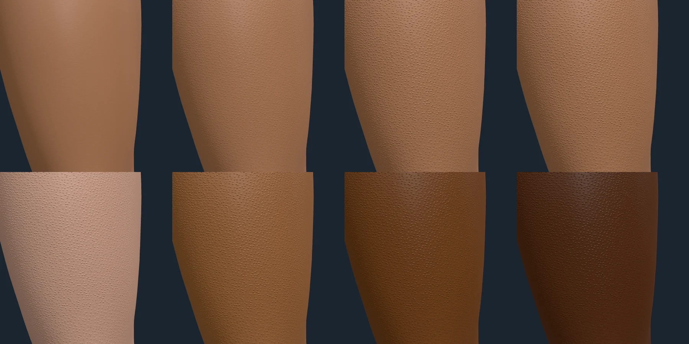
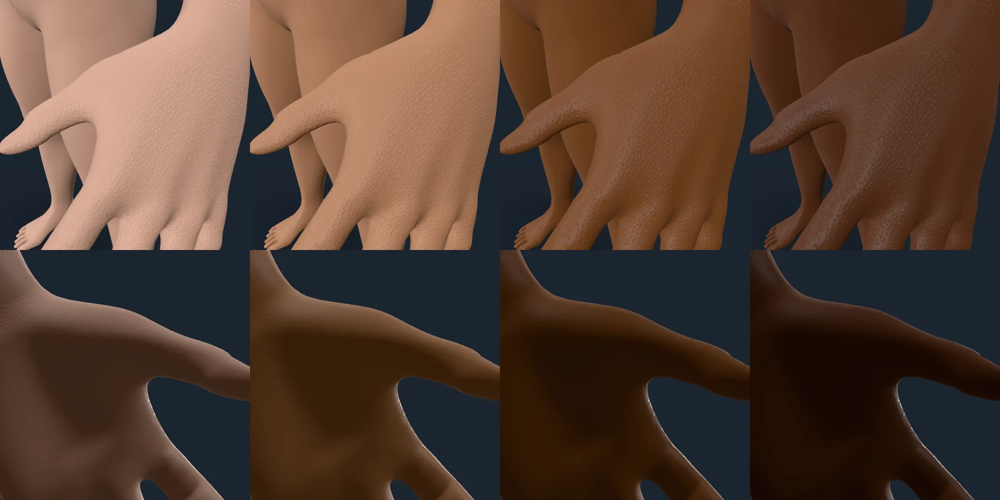
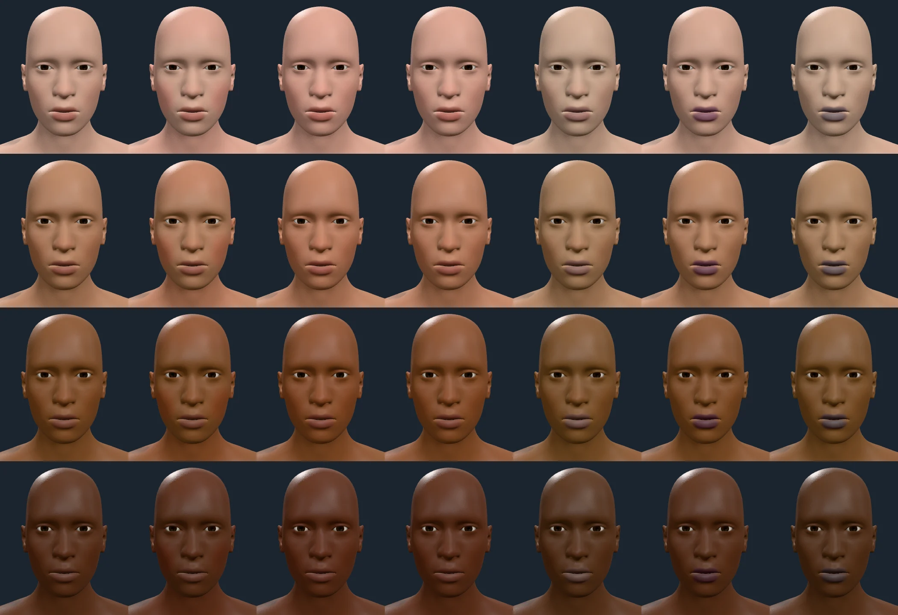
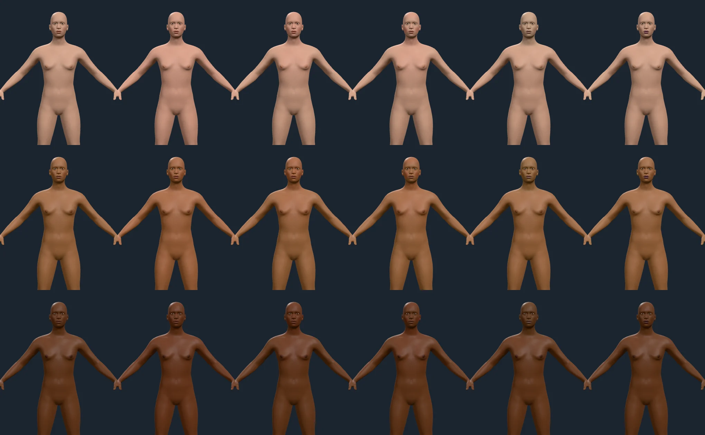
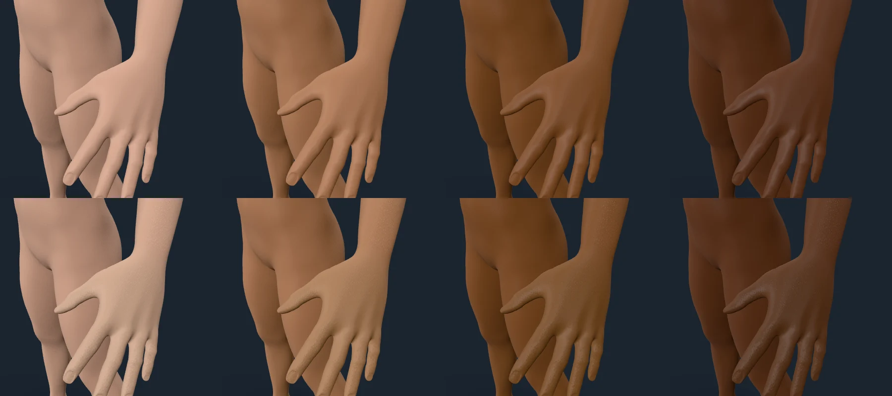
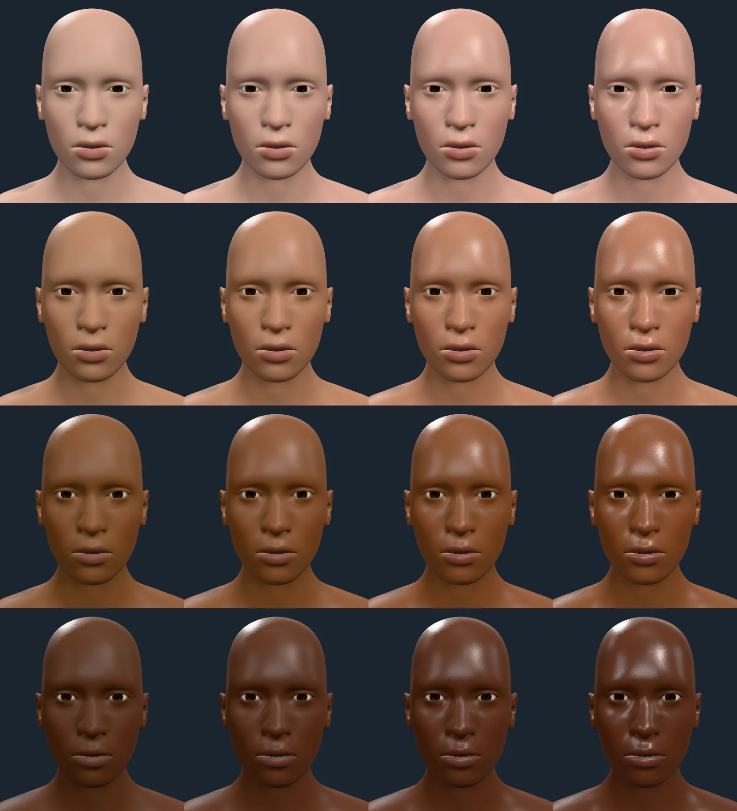
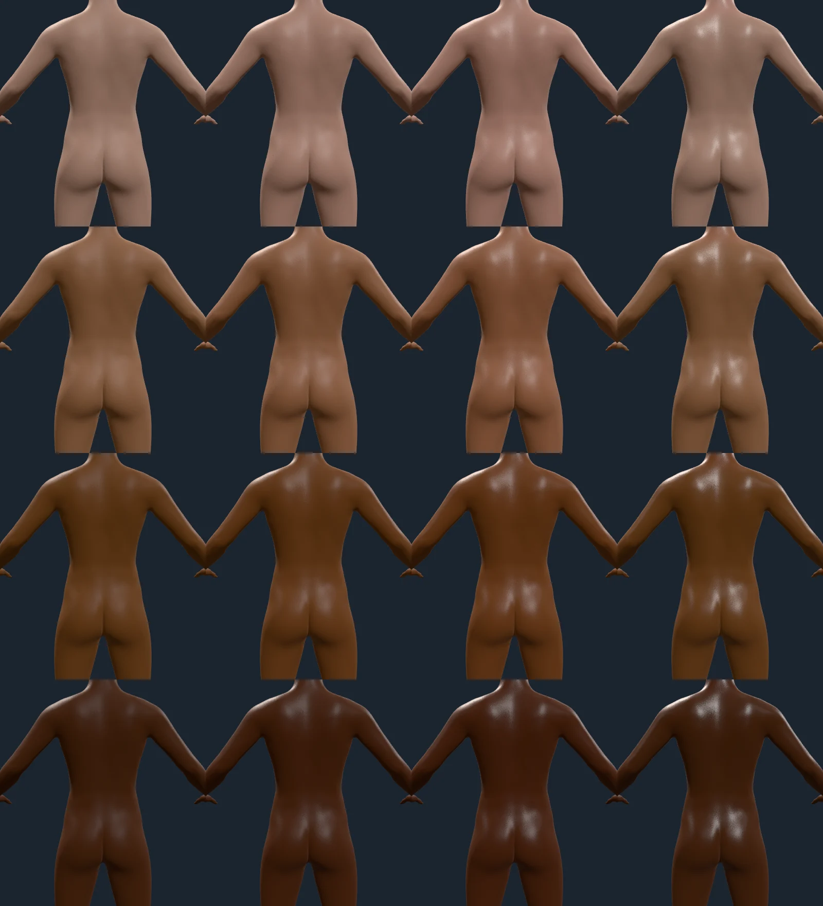

# Skin states

Rendered on 2026-10-09 with `scripts/contact-sheet.mjs` against the playground
(entries' `$signals` key sets the state): the default figure on the studio
stage, with only the skin and its state changed. Sources and choices for every
magnitude are in `docs/research/SKIN-STATES.md` Part C.

## Goosebumps (`cold`, `fear`)

Top row, melanin 0.35: rest, `cold` 0.5, `cold` 1, `fear` 1. Bottom row, `cold`
1 at melanin 0.08, 0.5, 0.75 and 0.95. The papules are 194 µm tall at 21 per
cm², one per follicle; half the signal is half the height. They read at every
tone, and a little less on the deepest, where the shading has less albedo to
modulate. Both triggers raise them.

Top: the back of the left hand and the fingers; bottom: its palm, from below
and inside, at melanin 0.08, 0.35, 0.75 and 0.95 with `cold` 1. The back of the
hand bears hair follicles and rises; the palm, glabrous, stays smooth. The first
version of this sheet found a fault that is fixed: bumps rendered as streaks
five to twenty times longer than wide on the thighs, because the relief
coordinate used a UV scale that varied across each face. The scale is now one
value per UV island (`uvScale`, `tests/layers.test.ts`).

Relief is a close-up effect. It is drawn at its true size (2.2 mm between
bumps) and fades where a bump is finer than about a pixel, so these sheets are
taken 15 to 30 cm from the skin, and at full-figure distance the skin shows no
bumps at all.

## Flush and pallor

Rows: melanin 0.08, 0.35, 0.65, 0.92. Columns: rest, `blush`, `exertion`,
`heat`, `fear`, `cold`, `cold` and `fear` together, each at 1. Blush reddens
cheeks, ears, forehead and neck; exertion the whole face; heat a little all
over; fright takes the colour out of the face; cold leaves the face and turns
the lips dusky violet, which fright greys. The first sheet of this page had the
cold lips a saturated violet, like lipstick; they now lose chroma as they turn.

On deep skin the same change is smaller, because the skin model's haemoglobin
span falls from a\* 5.2 to 3.1 as melanin rises: the bottom row's blush reads on
the cheeks and not elsewhere. There is no separate rule for it.

Rows: melanin 0.15, 0.5, 0.85. Columns: rest, `heat`, `exertion`, `blush`,
`fear`, `cold`. The whole-body regions read at this distance: heat over the
body, exertion on the face, neck and chest. The first version of these deltas
(0.4 to 0.8 of the axis) did not.

Top: rest; bottom: `cold` 1, at melanin 0.1, 0.4, 0.7 and 0.92. Hands blanch
more than the forearm, and rise in goosebumps.

## Sweat sheen (`heat`, `exertion`)

Rows: melanin 0.08, 0.35, 0.65, 0.92. Columns: rest, `heat` 0.5, `heat` 1,
`exertion` 1. The forehead and nose shine first, as the forehead sweats most
(0.99 mg/cm²/min against the head's 0.489); exertion wets the whole face. The
sheen reads at every tone, most on deep skin, where there is least diffuse
light to compete with it.

The same states from behind. Heat shines the upper back (the second wettest
site at rest, 0.564) and the buttocks (0.4); exertion wets the back, arms and
legs more evenly, as the paper finds. The first version of this sheet had white
speckle on the upper back under exertion, where a roughness of 0.22 let the
pore map's micro-normals catch the key light; the change is now −0.2 (roughness
0.32).
