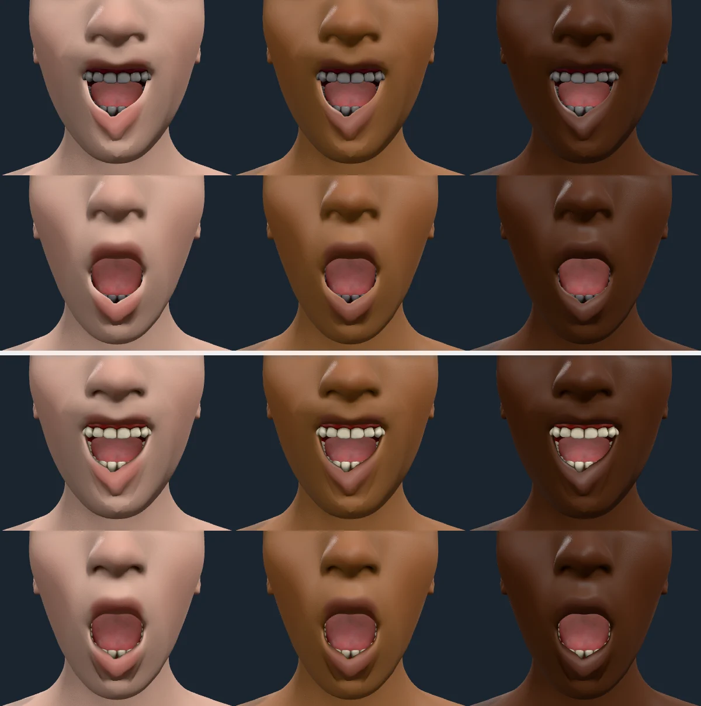

# Teeth

Rendered on 2026-10-09 with `scripts/contact-sheet.mjs`: melanin 0.05, 0.5 and
0.95 left to right; the first row of each pair is a smile with the jaw
dropped to 0.6 and the lips apart, the second is `JawDrop` at 1. The default
set, so the tongue is in the mouth.

**Before.** The teeth were a flat mid grey at every tone, darker than the skin
around them. Real teeth are the lightest thing in a face.

**Cause.** Not occlusion: with the attachments' occlusion switched off the
teeth were no lighter (the tongue, which is occluded, brightened to full pink;
the teeth did not). The pack carries MakeHuman's material as it is, a flat
diffuse colour of 0.64 multiplied into a texture whose teeth are mid grey
(sRGB 0.57 on average, 0.28 in linear light). MakeHuman multiplies in its own
display-referred pipeline; here both are decoded to linear light, so enamel
came out at a linear albedo of about 0.18, the grey of an unlit tooth.

**Fix.** Teeth are drawn with the colour that makes their texture reach the
albedo of enamel (`attachmentColour`, `src/render/attachmentLook.ts`): CIELAB
L\* 76, a\* 0.5, b\* 12, from the lighter, less yellow end of VITA A1 to A2
dental spectrophotometry (the full A2 yellow, tried first, read as stained
against skin at every tone). Dividing by the texture's measured mean means the
shipped texture's shading, gums and cusps are kept and only its overall level
changes; a test re-measures the shipped texture and fails if the constant
drifts. The mhmat's 0.64 is no longer used for teeth. Every other attachment
is drawn as the pack describes it.

**After.** The teeth read as ivory enamel at every tone, with the cusp and
gum-line shading of the texture intact, and the darkest skin keeps its teeth
bright against it.
