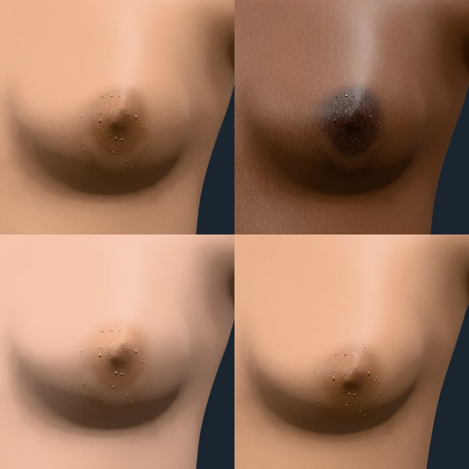
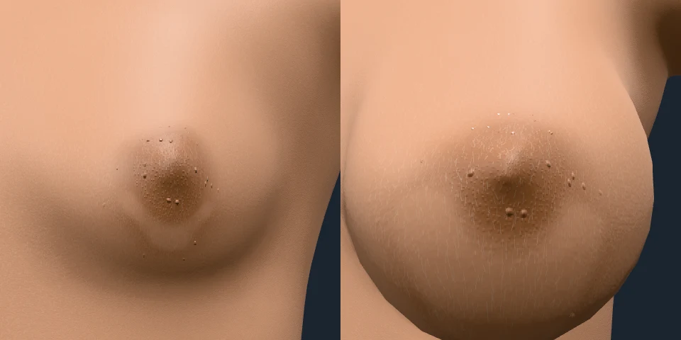
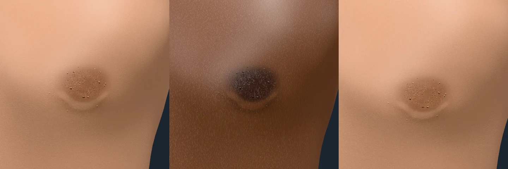
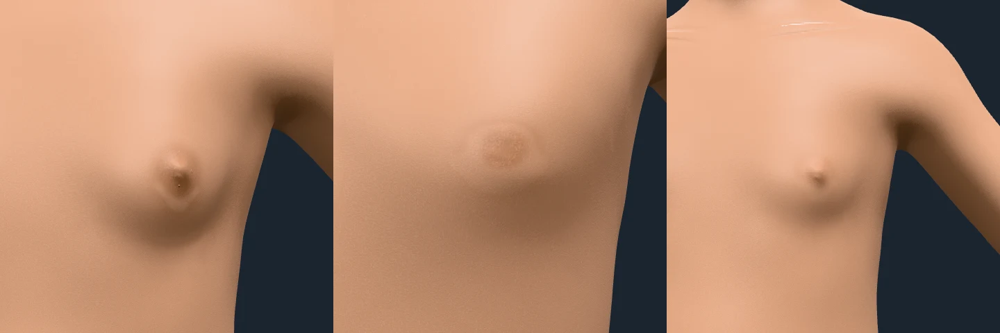
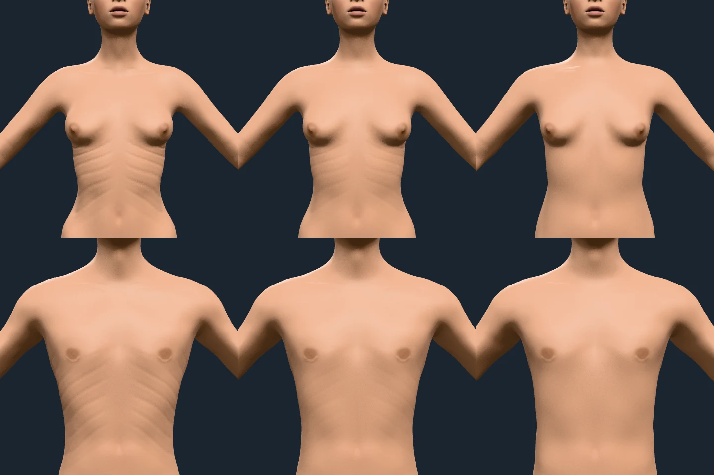
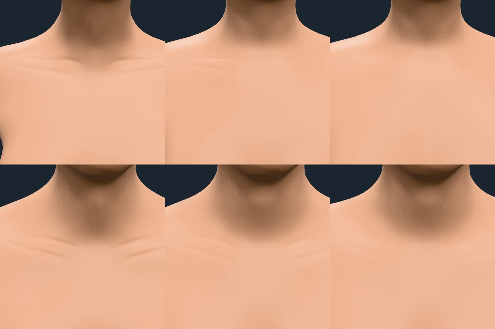
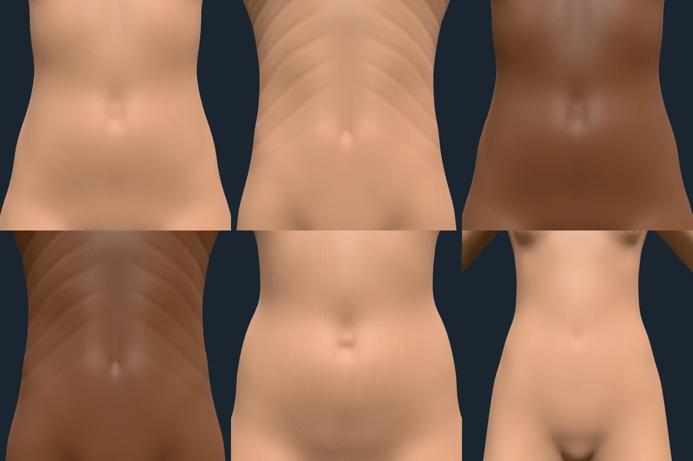
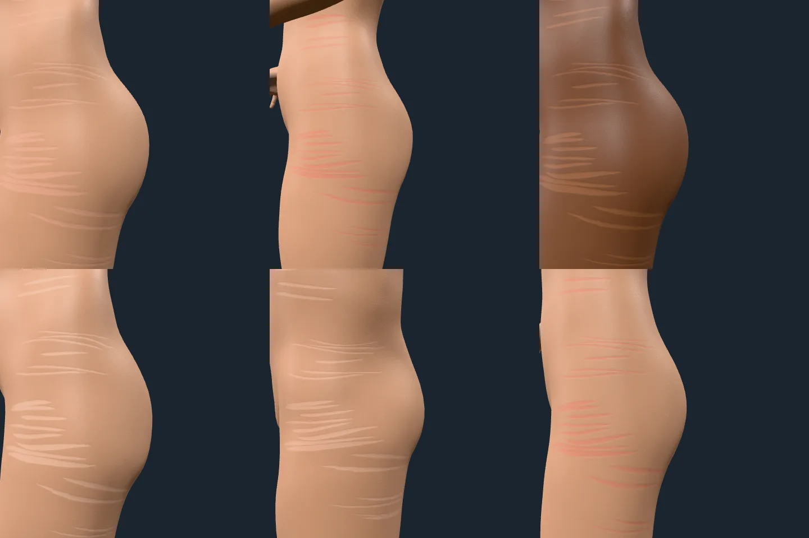
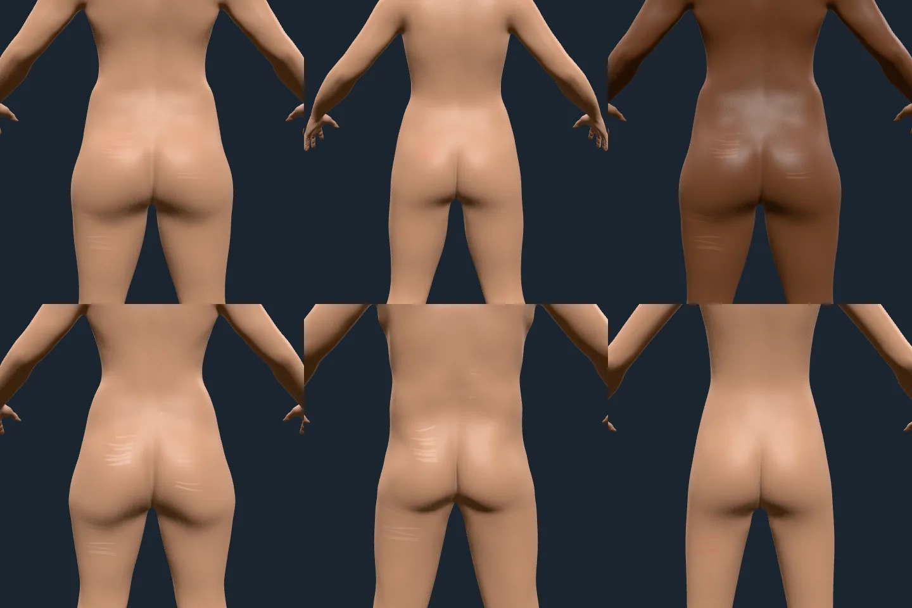
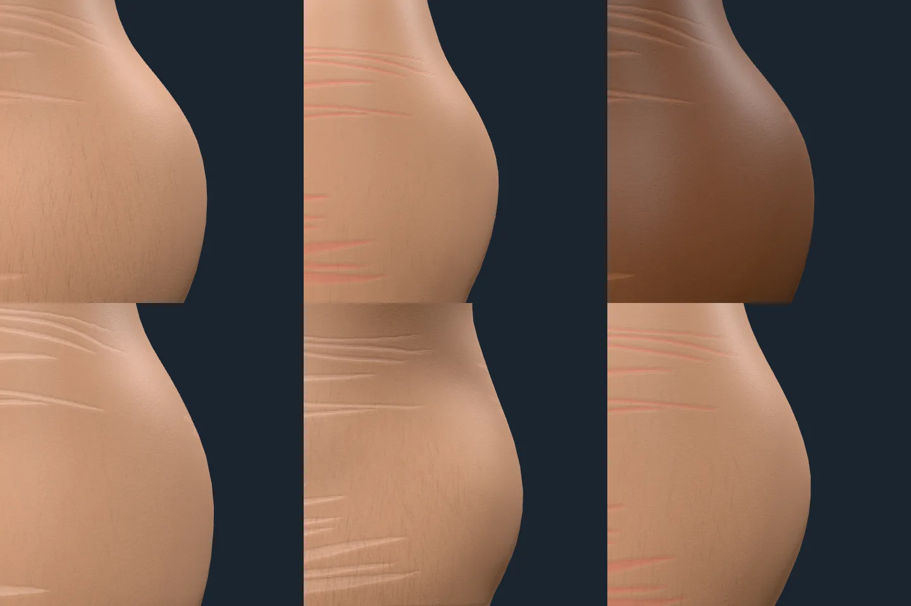

# Torso: evidence

Contact sheets of the trunk's own skin, rendered through `hk-sheets` from the
playground with `?frame=` (the camera aims at a bone by name, `at=` moves the aim by
a world offset) on 2026-10-09. What each layer is and where its numbers come from:
docs/ARCHITECTURE.md, "Torso", and docs/research/SKIN-STATES.md, C7.

## Open, failing

Each item stays here, with the sheet that failed it, until a new sheet passes; the
sections below describe what was drawn, not a passed verdict.

- **A pale haze on the deep-toned figure's lower back.** Under the camera light
  the heavy deep-toned woman's lumbar skin shows a broad whitish blotch (the
  back sheet, top right). It is on integration before the stretch marks were
  redrawn and is not their shape; its cause is not yet found.

Passed on the integrator's sheets (2026-10-09) and landed: the stretch marks,
redrawn as clusters of long, thin spindles (they had read as a barcode:
horizontal, evenly spaced, dashed straight lines tiled over the flank, buttock and
back; a clustered-spindle attempt, feat/area-torso 53cbfd2, failed its sheet for
mirrored seeding, short and wide marks and a flank framed from the front); the collarbone as a
smooth swell with the supraclavicular hollow above it, no groove (it had
rendered as a raised crescent with a hard outline, the crease layer's two
grooves); and the areola with its coordinate held at 1 past its disc (the ring
step and the tubercles outside it had one cause, the edge triangles sweeping back
to the nipple's stop) and each tubercle drawn whole inside its solid colour less a
millimetre. The bright streak above the deep-toned areola under the on-axis
camera light is the skin's own specular along the base mesh's breast crest (a
render without any torso layer keeps it), not a torso layer's.

## Nipple and areola

`frame=breast.L&at=0.100,-0.045,0.137&view=0.35,-0.1,0.93&span=0.11`, lit from the
camera (the offset is the nipple's from the breast bone's head, measured on the
evaluated mesh). Adult women, age 30 at the default tone, melanin 0.85 and 0.15, then
age 60. The areola is a round disc a little under 40 mm across that fades into the skin,
the nipple darker than it (by the measured ratio), a granular texture over both, and
about a dozen Montgomery tubercles, 1.5 mm and 0.4 mm high, in a ring inside it. The
deep tone's areola is far darker than its skin and the fair tone's pink-brown, both
from the measured melanin axis.

Breast size 0.1 and 0.9, same framing: the areola is 15% smaller or larger and stays on
the nipple; on the largest breast, where the skin is stretched twice over the base
mesh's, it is broad and soft. Its size in metres is put on the base mesh by the measured
stretch (`Evaluation.areolaScale`): without it the ring ran a centimetre outside it.

Men at 30 (default and melanin 0.85) and 45 at weight 0.8: a 28 mm areola, the nipple a
shade lighter than it (Motosko et al.: lighter in men, darker in women), the same
texture and a few tubercles (about four).

`span=0.14`, the offset averaged for the three. The areola is small and barely darker
than the skin at 7 (13 mm across), with no tubercles and a nipple of a millimetre or two;
by 12 it has grown through puberty (`pubertyProgress`), the girl's nipple standing out
and the boy's areola a faint disc with its texture.

## Ribs

`frame=spine01&at=0,-0.02,0.1&view=0,0,1&span=0.55`, lit from the camera. Top row a
woman, bottom row a man, age 25, weight 0, 0.2 and 0.5. The grooves between nine
ribs fall outward from the breastbone, clear of the breast, the arms and the
breastbone's strip; their strength is the figure's body fat (Gallagher's equation of
the body mass index its own mesh has): plain at weight 0, faint at 0.2 and gone at
0.5, where the figure is no longer lean enough for them to show. A man shows them
at a higher weight than a woman, as his fat is less at the same index.

## Collarbones

`frame=clavicle.L&at=-0.04,0,0.03&view=0,0.35,1&span=0.22`, lit from the camera.
Woman then man at weight 0, 0.5 and 1. A ridge on each collarbone's axis between
the fossae above and below it: sharp at weight 0, faint at 0.5 and gone at 1 on the
woman, who has more fat over the bone; a man's are plainer at every weight. The
first sheets showed loops at the bones' ends and a staircase along the rib window's
edge: the coordinate fell to 0 outside each window, so the triangles on its edge
swept through every groove they skipped. It now runs on, held at its ends, and
`tests/torso.test.ts` holds each layer's coordinate to its gradient across every edge.

## Navel and midline

`frame=spine03&at=0,0,0.14&view=0,0,1&span=0.28`. A default woman, a lean muscular
man (the ribs run on to the lower chest), a deep-toned woman, a deep-toned lean man,
a heavy woman (stretch marks on the belly, running across it) and a girl of 12. The
navel is the mesh's dimple with a pinker, darker hollow; the linea nigra is faint at
rest by design (12% of a full line, after puberty only) and the linea alba a furrow
half a millimetre deep that shows only on the lean man: both are softer than a
strip a vertex wide can make them. The pregnancy state, later, takes the linea nigra
to full strength.

## Stretch marks

`frame=root&at=0.1,0.0,0.0&view=1,0.1,0.2&span=0.4`, lit from the camera, 40 cm
across. Heavy woman 25, heavy girl 15 (new marks, red), heavy woman 25 at melanin 0.85
(old marks, lighter than the skin, the hypopigmented marks the clinical descriptions
give), heavy woman 60, heavy man 30, a tall girl of 15 at average weight (fewer, red).
The marks are clusters of long, thin spindles, several to a cluster, a centimetre or
so apart, of varied length, running round the body across the stretch and following
its curve, with bare skin between the clusters; each side of the body has its own.

`frame=root&at=0,0.05,-0.1&view=0,0.1,-1&span=0.6`, the same figures. The lumbar
back's site weight is lower than the flank's, so it carries fewer clusters, and the
marks stop 1.5 to 4.5 cm short of the spine.

`frame=root&at=0.14,0.02,0.02&view=1,0.05,0.1&span=0.18`: the spindles' tapered ends,
their gentle meander and the soft, shallow dip of their relief (a fifth of a
millimetre). At the distance of a whole figure the marks blend to their mean cover
rather than shimmering, and barely show, as on a person.

## Not drawn, and limits

- The marks stop short of the back's midline: the body's UV islands meet there and
  the marks are drawn in UV, so a mark that crossed it would be cut and offset, and
  the seam's vertices measure an orientation mixed from both islands (at 2 cm it
  tilted the marks into chevrons). The soles' ridges share the limit.
- The marks do not fork, and their direction is round the body everywhere on the
  sites: on the inner thigh and the breast, where real marks run other ways, they
  are not drawn.
- None of the layers adds shape: the nipple's height, the navel's dimple and the rib
  cage are the mesh's; a layer colours and shades.
- The base mesh's vertices are about a centimetre apart, so the linea nigra and the
  collarbone's ridge are soft bands.
- The areola frames are 11 cm across because the playground camera's near plane is
  10 cm and a nipple stands 3 cm out: a closer frame clips it.
- The tubercles catch the light as small glints on the camera-lit sheets (0.6 mm high
  made them glare; 0.4 mm is the compromise), and none of this is geometry: the nipple's
  height is the mesh's.
